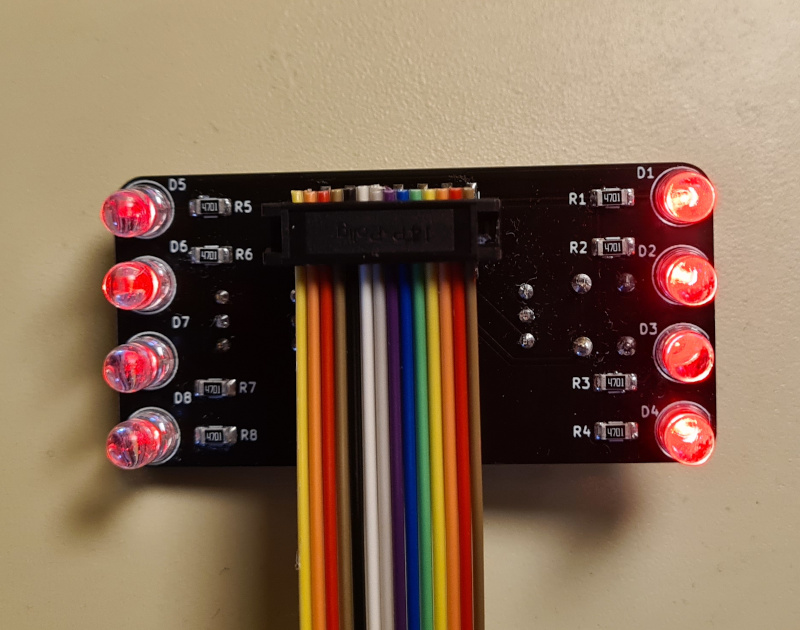
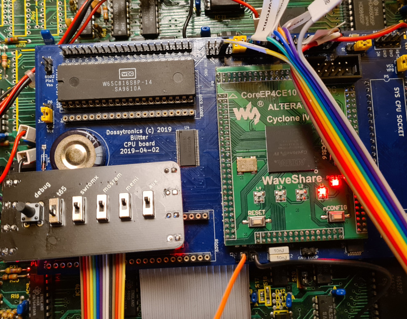
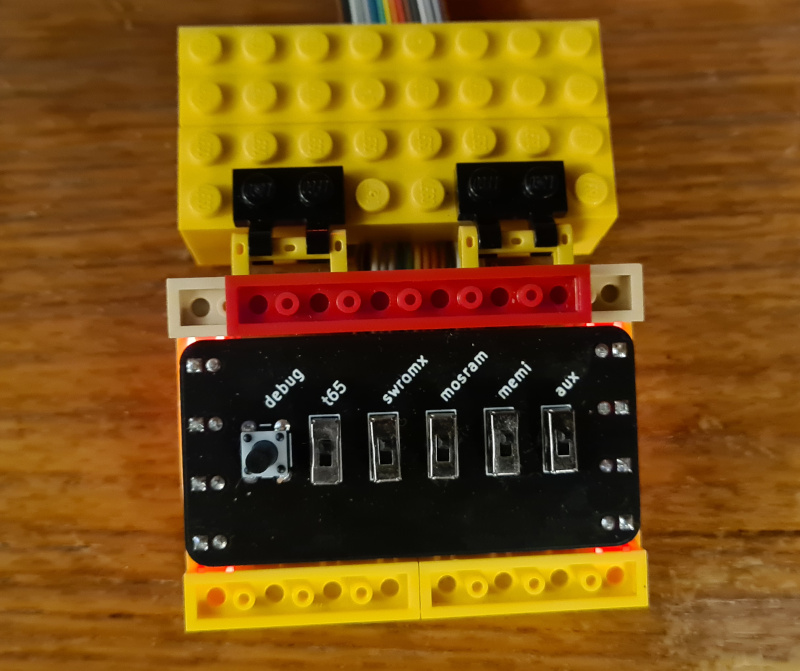

Buttons Board
=============

The buttons board is a small daughter board which may be attached to the 
configuration headers of the Mk.2 or Mk.2 Blitter boards.

The board features a single push button for connection to the debug input 
and 5 switches for controlling the boot-time configuration switches. The
board also features 8 LEDs which are mounted on a 8mm spacing and are approx.
4.8mm diameter meaning that they can be used to interface with Lego bricks

The board should have been supplied with a ribbon cable to attach to the 
Blitter board. This will have a 14-way receptacle on one end which should be
attached as indicated below. Note: brown wire should be closest to the "J1"
marking on the board.

The wires should be attached to the blitter board as indicted in the table
below

| Wire Colour	| Function	| Mk.2 (J5)	| Mk.3  	     |
|---------------|---------------|---------------|--------------------|
| Brown		| Ground	| Any top row	| Any bottom row J56 |
| Red		| LED power	| 3v3-rightmost | * see note         |
| Yellow	| Debug button  | CFG7		| AUX_io6 J16        |
| Blue  	| t65		| CFG0		| G3 J56	     |
| Gray		| swromx	| CFG4		| G4 J56	     |
| Black		| mosram	| CFG5		| G5 J56	     |
| Red    2  	| memi		| CFG8		| G6 J56	     |
| Yellow 2	| aux		| -		| -		     |

Note: The aux connector is for future expansion and should be left unconnected
Note: the LED power is optional. On the mk.3 board it may be connected to any
      suitable point on the motherboard where with 3 or 5V are available

**MK.2**

**MK.3**

TODO: connected mk3

## Lego

Connected and built into small Lego enclosure:

