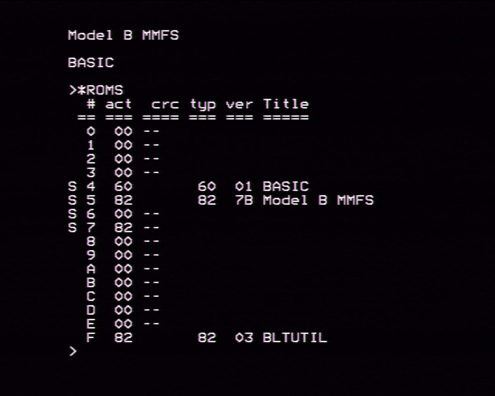
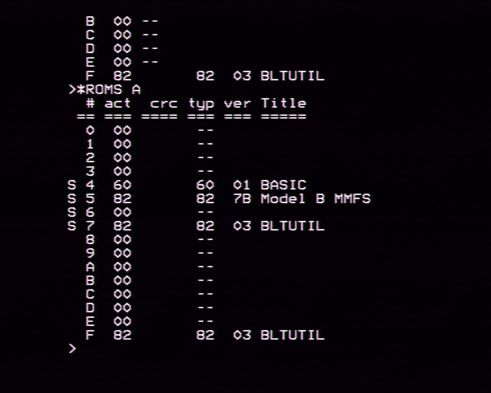
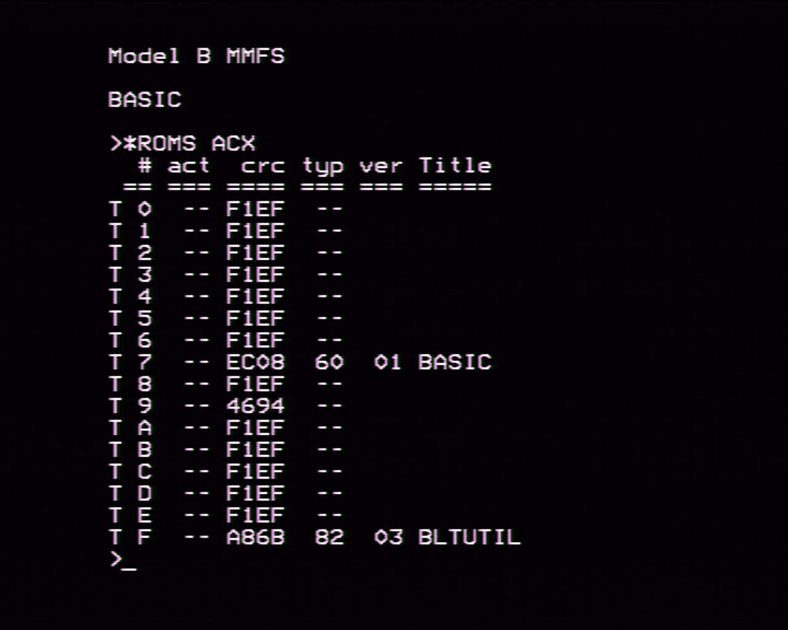
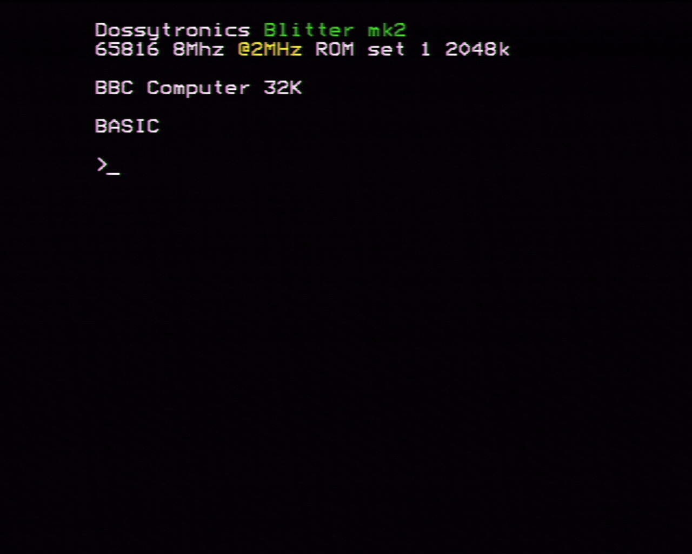

Getting Started - BBC Model B
=============================

This guide is intended to guide you through some first steps in using the 
Blitter board. It is not intended to be a complete reference.

The accompanying disc images are available [here](assets/getting-started/discs.zip)

# Preparing the base machine

Before inserting the card in a model B for the frst time it is recommended 
that you should:

 * remove any other sideways ROM/RAM expansions, you will hopefully not need
   these anyway
 * remove any 1MHz bus devices whilst doing initial setup and testing
 * remove any TUBE devices whilst doing initial setup and testing
 * remove expansion ROMS but keep BASIC and whatever filing system you wish
   to use to load ROMs ([see Choosing a filing system](#choosing-a-filing-system))
 * remove the 6502 CPU
 * place the supplied 6502 BLTUTILs ROM in the right-most (highest priority
   ROM slot)
 * VideoNULA is recommended but not required

Your machine should now look like this:

## Choosing a filing system

The Blitter in 6502 mode should work with most filing systems *except* for 
unmodified RetroClinic DataCentre board which take over the 1MHz bus JIM 
interface in such a way that is not compatible with the Blitter. An updated
[firmware and ROM is available for the DataCentre](https://github.com/dominicbeesley/DataCentre)

In this example a simple user-port MMFS solution is used. Other options
that have been widely tested are:
 * ADFS (Disc and Winchester)
 * 1770 DFS
 * 8271 DFS
 * HOSTFS

The commands in the examples below i.e. DIN refer to the MMFS insert disk
command where this command is seen and you are using a different filing 
system then insert the relevant disc using the relevant command or by
inserting the given floppy disc.

## Strip down the Blitter to a minimal configuration

**Mk.2**

* remove all hard CPUs
* remove all jumpers except:
  - P6 CPU voltage set to 3.3V (south)
  - J5 configuration jumper on position marked "0" (3rd from left) - selects T65 internal CPU
  - J2 SYS CPU Gnd - additional ground taken from motherboard
  - J8 Power Select - East - take power from motherboard

[See Hardware Overview](hardware-overview-mk2.md) for more information about
jumpers

**Mk.3**

TODO

## Insert the Blitter into the motherboard

Take great care when fitting the board as it is very easy to bend/break pins
on the riser plug. 

### Raising the blitter

If you need to use a Watford Electronics or RetroClinic 1770/2 daughter board
with the Mk.2 blitter you may need to add about 1.5cm of height to the Blitter
this can be achieved by piggybacking 5 turned-pin 40pin dip sockets on the
end of Blitter to CPU socket riser plug.

When fitted the board should look like this:

**Mk.2**

**Mk.3**

TODO

Double check by looking under the board as best you can that the pins of the 
riser are correctly aligned with the motherboard CPU socket.

# First boot

You should now be able to power on the machine and should get a boot screen 
like this:

If the machine doesn't boot then switch off and work through the 
[Troubleshooting](#troubleshooting) section.

You should then be able type type

    *ROMS

at the command prompt and receive a display of the ROMS in the machine thus:

The ROMS that show through in slots #4-#7 should correspond to those fitted
in the motherboard. 

The following sections will discuss loading up the default set of ROMs
you may have been supplied with a board which is pre-loaded with ROMs in 
which case you may want to skip all or part of the following sections.

# Loading other ROMs

This section will guide you through loading some ROMs to the slots provided
by the Blitter card.

When following these examples the syntax of the BLTUTIL ROM utilities can
be found on the [GitHub Wiki](https://github.com/dominicbeesley/blitter-vhdl-6502/wiki/BLTUTIL-Star-Commands)

## Load BLTUTILS to slot \#F (15)

It is desirable to have the utility ROM be in the highest slot:
 * the NoIce debugger only works in slot F
 * holding down "£" at boot can be used to "catch" corrupted ROMs (see 
   [Troubleshooting](#troubleshooting))

Please use the ROMS65.SSD file with your filing system. In this example it
is on MMFS

    \*DIN 0 ROMS65
    \*SRLOAD BLTUTIL F

This will load the ROM in slot F of the current map. You should get the 
following:

You should now press CTRL-BREAK to refresh the MOS ROM table. Typing:

    \*ROMS

Should now show

The OS has now disabled the ROM at #7 as it is identical to the one in 
slot #F. However, if you loaded a different version of the BLTUTIL ROM to the
one in the socket on the motherboard you may see both showing in the \*ROMS 
list and also see two Blitter boot messages. 

Note: if you attempt to overwrite the current BLTUTIL rom at any time
the load should work but you will not be returned to the command prompt, 
instead the machine will hang after the "...OK" message. This is deliberate
you will need to press CTRL-BREAK to get the MOS to reload the ROMS table.

You can at any time add a parameter "A" to the \*ROMS command and it will
show all the ROMS, even those ignored by the MOS

    \*ROMS A

There are also options 

  * "V" to show more verbose ROM titles (including version)
  * "C" to show a CRC for each ROM

It can be useful to keep a note of ROM CRCs when they are first loaded,
especially to sideways RAM to check for corruption. Here you can see that
the ROMS at #7 and #F have the same CRC.

You could now remove the BLTUTILs ROM from the motherboard however it
is not recommended as it can be useful to use the MEMI jumper to boot
with the Blitter ROMs disabled. (see [Troubleshooting](#troubleshooting))

## ROM Notes

In map 0 the slots #4-#7 map directly to the four motherboard sockets
and the MOS ROM is taken from the motherboard socket

In map 0 (the default map, for alternate map see [Alternate ROM sets](#alternate-rom-sets))
the even numbered slots map to battery backed RAM and odd numbered slots
map to Flash EEPROM. There is little difference between the two except
that RAM is marginally faster but is more susceptible to accidental 
erasure or corruption

## VideoNULA

Some of the demos in this document work best when there is a VideoNULA 
fitted. They use the advanced palette features of the NULA. However, 
the demos will run without the NULA but the colours will be wrong.

The VideoNULA ROM be present in the machine. You may either install it 
in the spare motherboard slot or load it to a spare sideways ROM socket. 
You should insert the disc/image supplies with your NULA and type

    \*SRLOAD NULA 3

Note: it is worth loading ROM images for frequently used and important
ROMS to odd-numbered sockets or to a motherboard socket (4-7) as the
sideways RAM sockets are more prone to becoming corrupted by errant
software.

# Try out CLOCKSP

You may now check to see the speed of the system:

    \*DIN 0 TOOLS65
    CHAIN"CLOCKSP"

As can be seen this is running at 2MHz. Even though the T65 core is 
capable of running at up to 16MHz per cycle on this firmware it is being
held back to 2MHz by the fact that the BASIC ROM, MOS and RAM are all being
accessed from the motherboard which has a maximum speed of 2MHz.

We could make BASIC a little faster by loading the BASIC ROM in to a Blitter
sideways RAM socket:

    \*DIN 0 ROMS65
    \*SRLOAD BASIC2 E

And press CTRL-Break

    \*DIN 0 TOOLS65
    CHAIN"CLOCKSP"

This has more or less doubled the speed of BASIC but we can do more:

    MODE 7
    \*BLTURBO L7F
    RUN

The [BLTURBO Lxx](https://github.com/dominicbeesley/blitter-vhdl-6502/wiki/Command:BLTURBO) 
command with the "L" switch will copy low memory in the range 0..7FFF to 
fast Blitter ChipRAM and then redirect CPU accesses to use this RAM. Each bit
in the number after "L" indicates a block of &1000 that will be redirected so
in our test above the memory 0-6FFF is taken from ChipRAM and 7000-7FFF is
on the motherboard.

The reason we had to switch to MODE 7 is that the MOS is currently unaware of
this remapping and will write any screen bound information to ChipRAM where there
is a remapping.

i.e. switch to MODE 0 and make the top most bank of memory be remapped    

    \*BLTURBO L80

You will now need to type blind:

    MODE 0

The mode should change and give some garbage at the bottom. The data that are
being written to 7000-7FFF are now going to ChipRAM instead of the motherboard
so the video system will display the old data. Repeatedly typing

    \*HELP

The help information will write correctly to much of the screen but no the 4K
that we have redirected to ChipRAM

    \*BLTURBO L00

will restore the screen.

We can have mode 0 work normally *and* have faster basic by using 

    \*BLTURBO L07

This will remap 0-2FFF to ChipRAM and leave screen ram at 3000-7FFF pointing at
the motherboard

Sometimes it is desirable, when ROMs or RAM is remapped to fast memory to have
the T65 run at a stable 2MHz this can be acheived with:

    \*BLTURBO T

This will "throttle" the core such that all memory accesses are synchronised
the motherboard's phi2 clock.

One can type 

    \*BLTURBO ?

to query the current settings.

When you have finished you may wish to erase the Blitter copy of the BASIC2 rom

    \*SRERASE E

This command can be used to clear any ROM/RAM slot (including motherboard sockets
where sideways RAM is fitted).

And Ctrl-Break - you may find the machine crashes when deleting the current 
language!

# Testing Sound

The Blitter board contains a Chipset feature called Paula which is closely 
modelled on the Amiga's Chip of the same name. One of the distinctive features
of the Paula is that it contains several independent channels which can play
sound samples at different sample rates. This is in contrast to newer machines
and many older machines such as the Archimedes etc that require complex 
and CPU intensive digital signal processing to play different notes. The
Paula concept is very much suited to 8 bit machines.

The Blitter board may be hooked up to the BBC Micro motherboard by attaching 
flying leads from the L and 0 pins of the Blitter audio header to the top
and bottom of resistor R172 on the motherboard respectively.

The audio headers are J3 on the Mk.2 and J32 on the Mk.3. The ground loop 
connector (J4 on the Mk.2 LK34 on the Mk.3) should be left un-bridged. 

This will mix the Paula sound with that of the BBC Micro and play it out 
through the internal speaker. Of course, it will sound pretty tinny and not
show off the true capabilities through a tiny speaker. 

Other options:
  
  * connect the Blitter as above and then unplug the BBC's internal speaker
    into "PC Speakers" or hifi

  * connect a larger speaker 4-16ohms to the bbc micro's speaker header. The
    LM386 is capable of delivering a few watts which is usually loud enough. 
    Alternatively there are a number of small amplifier modules on ebay which
    will deliver a decent amount of loudness from a single 5V supply which can 
    be source from the BBC motherboard [this is the solution I use]

  * connect some "PC Speakers" or other amplifier direct to the Blitter sound 
    output - you may need to experiment with the ground loop jumper if there 
    is excessive hum. You will not get the BBC motherboard sounds through the 
    speakers

Note: care should be taken when connecting to hifi equipment that the earthing
arrangements of the BBC Micro and Hifi are not incompatible. PC Speakers tend
to be designed to be hooked up to a device such as a desktop PC which is 
referenced to mains earth. If in doubt, ask!

## Playing some tunes

The paula.ssd demo disk contains a handful of tracker modules and a player.
More mod's are available on stardot.org.uk - as these are quite large it is
recommended that .adl or ADFS disks are used as these allow for much larger
trackers and are many times faster to load. (TODO: investigate ADFS MMFS)

    \*DIN 0 PAULA
    \*EXEC !BOOT

You should now be able to select one of the tunes to play - it may take some
time to load.

Press H for options or ESCape to stop.

# Blitter

The Blitter Chipset feature is a virtual device for quickly performing
various bitmap operations such as drawing sprites and lines. For more
information see [Chipset](chipset.md#the-blitter)

## Run the demo

    \*DIN 0 DEMO65
    \*EXEC !BOOT

You should see demo which shows some smoot scrolling of large graphics
at 50 frames a second.

# Aeris

The Aeris is a Chipset feature which is analogous to [Copper](https://second.wiki/wiki/copper_amiga)
chip of the Amiga. It can very quickly perform operations that are
synchronised to the position of the display raster with very little
intervention from the CPU. This can produce some advanced graphics
effects such as palette cycling and vertical rupture whilst leaving 
the CPU free to handle game or demo control logic. 

For more information see [Chipset Aeris](chipset.md#the-aeris)

## Hookup the Aeris

To stay in sync with the display raster, whatever the screen mode, the
Aeris needs to monitor the horizontal and vertical sync lines of the 
CRTC controller. To do this please hook up the Blitter board to the 
CRTC as follows:

### mk.2 Aeris Hookup

 * Pin 14 of the configuration header (J5) should be attached to pin 40 of the
   CRTC (IC2, near middle North of the motherboard)
 * Pin 15 of the configuration header should be attached to pin 39 of
   IC2

### mk.3 Aeris hookup

  TODO

## Bigfonts demo

The supplied bigfonts.ssd demo shows off some of the capabilities of the 
Aeris by scrolling some large bitmaps (using the Blitter Chipset) and 
doing various palette cycling and poking:
 
 * the outlines of the letters are cycled once per frame to make them
   appear to move at a different speed to the letters
 * the copper bars redefine the palette on each line without CPU 
   intervention
 * the copper bars are redefined also in the middle of the line

To show how much the Aeris and Blitter can assist with off-loading CPU
processing this demo is written in C, which is relatively slow, and runs the
CPU at 2MHz.

A further demonstration of the Aeris can be had by going back to the 
music player demo above and pressing the 'A' key. The colours of certain
text-columns in mode 7 are used to form a vu-meter.

# Alternate ROM sets

The Blitter provides a second bank of sideways ROM/RAM which may either be
used as an alternate set of ROMs for the T65 core or as a separate set of
ROMs for a hard CPU.

In this section an example will be given of loading up an alternate ROM set.

Before starting please check that your machine is set to run in Map 0 you
should get a boot message like the one in the picture below the important
parts are circled.

If you don't please check that the jumpers are set follows:

**MK2**

J5 (config):
  
  - CFG0 FITTED 
  - CFG4 NOT FITTED 

Refer to [Hardware overview](harware-overview-mk2.md#j5-system-config)

**MK3**

TODO

## Accessing the alternate ROM set

The SRLOAD, SRERASE and ROMS commands all take an optional X switch which
will display the opposite set map to the one currently being accessed by the
CPU. Alternatively the map to use can be explicitly set by adding a 0 or 1 as
the final parameter.

## Check alternate set is blank

Executing the next line when in T65 mode and the SWROMX jumper is not fitted
will list the alternate ROM set from map 1

    \*ROMS ACX

This will be equivalent to executing 

    \*ROMS AC1

If you have started with a blank blitter board you should get a display like
this:

Note: the special CRC F1EF is an indicator that all bytes of the entire 16K 
of each bank is set to the value &FF.

If any of the ROM slots is not blank or doesn't have a CRC of F1EF then
type 

    \*SRERASE # 1

replacing # for the number of the non-blank slot.

## Loading up an alternate ROM set

When the Blitter has an alternate ROM set active not only do the sideways
ROM slots come from the alternate ROM set so does the operating system MOS
ROM. For this reason first we will load up an alternate MOS ROM and try
rebooting.

    \*DIN 0 ROMS65
    \*SRLOAD M.MOS120 9 X

Rom slot #9 in map 1 has a special purpose as it is the MOS rom slot for
that map and therefore should not be used for loading normal ROM images.

You should now type

    \*ROMS ACX

and the CRC for slot #9 should now be 4694 which is the CRC of the MOS 
ROM.

You can now try booting to the alternate ROM set by fitting a jumper as 
follows:

**MK2**
    
    J5 - fit jumper to CFG4 (SWROMX)

**MK3**

    TODO

Refer to [Hardware overview](harware-overview-mk2.md#j5-system-config)

You may change the jumper settings any time when the blitter is running
- they will will only take effect after the next time Break is pressed.
Usually when swapping between maps it is best to press CTRL-Break to 
ensure that the MOS updates its ROM map.

Press CTRL-Break, you should see:

This shows that the MOS in slot #9 has been recognised but no other ROMS
are present.

Please now switch back to map 0 by removing the SWROMX jumper and reboot
with CTRL-Break.

You should now load up the remainder of the ROMS to the alternate ROM
set:

    \*DIN 0 ROMS65
    \*SRLOAD BLTUTIL F X
    \*SRLOAD BASIC2 3 X

If you are using ADFS, HOSTFS, DFS you may also load these ROMS to the
alternate set. Unfortunately, at present MMFS relies on timing loops to
function correctly and so cannot be run from a Blitter ROM slot. It is 
hoped to have a correction for this in the near future whereby ROM slots
can be marked as throttled.

You should now be able to swap between sets and have a functioning system

# Hard CPUs

The following sections give a brief introduction to running alternate
CPUs in the sockets provided on the Blitter board. 

Please remove the SWROMX jumper if you fitted it above

## Running a 65C02

In this guide you may run either a Rockwell 65C02 or similar at 4MHz or
a faster W65C02S at 8MHz.

The pictures in the example show the W65C02S8P-10 please ensure that
you have selected the correct jumper settings for the speed grade and
supply voltage required. In general most of the older 65C02 chips 
should be run at 5V but the W65C02S (i.e. S suffix) do not run well
at 5V due to their requirement for a larger voltage swing on the data
and control lines.

**MK2**

Insert the CPU into the board as pictured and set the CPU configuration
jumpers as follows:

 * for 4MHz or faster parts fit CFG3 and leave CFG1 and CFG2 empty
 * for 8MHz or faster parts fit CFG2 and leave CFG1 and CFG3 empty

For further information see [Hardware overview Mk.2](hardware-overview-mk2.md#j5-system-config)

Please ensure that:

 * the Pin 1 notch is to the West
 * the CPU is in the topmost CPU slot

### Loading ROMS and MOS

The hard CPU needs its own set of ROMS separate to those used in normal
T65 mode. These should be loaded as follows:

    \*DIN 0 ROMS65
    \*SRLOAD BLTUTIL F X
    \*SRLOAD BASIC2 7 X
    \*SRLOAD MOS120 9 X

Note: the X modifier after the ROM slot indicates that it should be loaded
to the other bank

The last of these commands loads the MOS operating system ROM into slot 9 
in map 1 - this is a special slot in that it is used to provide the MOS rom.

You should check that these, and no other, ROMs are loaded to map 1 by typing

    \*ROMS ACX

Which will list all the ROMs in map 1 along with their CRC. your list should
look like this:

Any unwanted roms should be unloaded using

    \*SRERASE # X

for each unwanted ROM, substituting the ROM number as appropriate.

You are now ready to boot to the alternate ROM set. You should remove the 
jumper from CFG0 to disable to disable the T65 CPU and press CTRL-Break

Notice that the boot message now says "65C02 8MHz". You may also type

    \*BLINFO

as a command to see the configuration.

There's not much you can do other than type in BASIC programs as there is
no filing system present yet.

Switch back to T65 by refitting CFG0 and pressing CTRL-Break

    \*DIN 0 TOOLS65
    LOAD"CLOCKSP"
    PRINT ~PAGE

This will load the CLOCKSP program to memory and display page which will be
something like "E00" or "1900". Remove CFG0 and press CTRL-Break again. Then
execute the commands below, substituting XXXX for the value of page from 
above.

    PAGE=&XXXX
    OLD
    LIST

You should now see the CLOCKSP program listed and be able to run it.

    RUN

You should now get the CLOCKSP results you may try using BLTURBO Lxx as 
described [above](#try-out-clocksp)

    \*BLTURBO L03
    RUN

This should run somewhat faster. Note depending on the configuration and type
of board you have the CPU may not be able to run at full speed.

You can get some more performance in BASIC by running a new version of BASIC.
Switch back to T65 by refitting CFG0 and loading BASIC 4.32

    \*DIN 0 ROMS65
    \*SRLOAD BAS432 7 X
    \*DIN 0 TOOLS65
    LOAD "CLOCKSP"

Then switch back to the 65C02 by removing CFG0 and pressing CTRL-Break 

    PAGE=&XXXX
    OLD
    RUN

CLOCKSP should now run significantly faster, especially the Trig/Log test.

Copying files from the T65 to the 65C02 like this is somewhat laborious. So, 
you will probably want now to switch back to T65 mode and load the ROM images
for your favoured filing system and other utility ROMS to the alternate ROM
set. Use SRLOAD but do remember to use the X modifier as appropriate.

## Running a 6809 or 6309

The Blitter supports either a 68B09E, 63B09E at 2MHz or a 63C09E at 3.5MHz. 

Before starting this tutorial please remove the MEMI and SWROMX jumpers if
they are fitted and ensure you can boot to T65 mode.

### 2MHz

All the CPUs listed above may be run at 2MHz it is sensible even when using
a 63C09E to try it out at 2MHz first.

**MK2**

The jumpers should be set as follows:

    P6 - 5V
    CFG1 on J5 fitted
    CFG2,CFG3 on J5 clear

For details see [Mk.2 Hardware Overview](https://github.com/dominicbeesley/blitter-vhdl-6502/blob/main/doc/hardware-overview-mk2.md#j5-system-config)

Insert the 6309 in the correct set of pins with pin 1 of the CPU to the left 
and the CPU inserted into the lower of the 6502/6x09 socket pair near the top 
left.

Please ensure that:

 * the Pin 1 notch is to the West
 * the CPU is in the second highest CPU slot, be careful it overlaps the 65xx
   sockets

## Load 6x09 ROMs

You should now be able to start the machine to load a set of ROMS and an 
operating system

When you are in T65 mode you can type

    \*BLINFO

as a command to see the configuration, the hard cpu that is configurated
should display even when it is not selected.

You will then need to load the 6809 MOS and BASIC roms from T65 mode:
 *SRLOAD M.MOS6809 9 X
 *SRLOAD R.BASIC 3 X
 *SRLOAD R.UTILS09 F X

and check with *ROMS X

You should then be able to boot the 6809 by removing the T65 jumper (CFG0) and press ctrl-break. Without a filing 6x09 system you should still be able to laboriously load/save BASIC programs by booting to T65 load the BASIC program there then switch to 6x09 mode (maybe fiddle with PAGE) then type OLD to get the program and vice-versa.

I really need to look at the troubleshooting bit but if things go pear shaped then there are a few things you can try:
- boot to T65 mode and hold down the £ key which should bring up a menu from there you can inspect ROMS and erase any suspect ones, I tend to forget the "X" modifier and load 6809 roms into the 6502 space by accident
- if you're unsure you can go nuclear and erase the whole of ROM or flash from the menu
- if you can't get at the menu you can fit a jumper to CFG8 which will inhibit the sideways rom stuff and try rebooting, you can then try the £ thing again and wipe Flash/RAM to get back to blank

The attached SSD should contain the latest ROMS/MOS for the 6x09 - I had to build it on my work machine and the build system is awful so I might have messed something up. High on my todo list is to get all this build stuff unpicked an placed on GitHub, I'm just unsure how to best cater for all the different build options I have and how to structure the projects in Git so I can nicely deploy all the finished articles into SSDs and deploy them into my hostfs directories.

If you're feeling adventurous you could try the HOSTFS rom in 6809 mode but I've not tested this with the RS423 port for a while - I have a second UART thing that I got from Myelin a while back. It should work in theory but I've not used it in anger for a few years. It was the next thing on my list to check.

For reference I've put a copy of my SVN in all its horror on gdrive - don't laugh, or cry! https://drive.google.com/file/d/1vgHyFDlZTaGzx_KrfFISKzdlKKMGWqqF/view?usp=sharing

# Troubleshooting

## NOTES/Q's for Hoglet

### Default Turbo/Throttle off

Currently the 65xx and 6x09 CPUs by default boot in a trim that allows them
to go as fast as the memory they are accessing will allow. This is usually
not a problem for games as by default they'll run from normal motherboard 
memory at 2MHz but ROMs may run faster which may cause problems (see MMFS
below). Would it be better to boot in "Throttled" mode where these CPUs 
boot strictly limited to 2MHz unless explicitly unlocked?

### BLTURBO L

I've not really given much thought to doing proper shadow memory. It should
be possible to do something akin to the B+ but that will mean some fannying 
around with the MOS? Or maybe just checking for instructions executing from
C000-D000? 

### Rom options

Any preferences on how the sideways ROM/RAM is split I've gone for a 
very arbitrary choice of RAM at even slots, ROM at odd slots and with
the motherboard punching through at slots 4-7 in map 0.

I need to add the following stuff
 * optional write protect on RAM slots
 * optional "slow" setting on non-motherboard slots
 * SRCOPY command

Would a "hard" unplug be useful? Any other requests for ROM management

### 65C02 "soft" CPU

The default fall-back mode is to run with a T65 FPGA core configured as a 
NMOS 6502. This gives maximum compatibility for Elk/BBC. Would it be desirable
to be able to be able to configure the T65 as CMOS - this would allow 
running BASIC 4, etc and possibly other Master compatible stuff but at the 
expense of loss of compatibility.

### MMFS

However, on one machine which otherwise seemed to work OK MMFS returned 
corrupt directories listings and the games menu would crash. Swapping the 
74LS245 (IC14) with and HCT device from another machine solved the problem. 
The swapped out 74LS245 worked ok in the original machine!?!

I've not got MMFS to work when loaded into the Blitterboard sideways ROM or 
RAM but I suspect that is because T65 will try to run at full speed and MMFS
is doing timing loops? If this proves troublesome I have planned but not 
started a facility to mark which ROMs should be allowed to run full speed.