Getting Started - C20K
======================

[Andy - I've thrown this together as a mashup from the other getting started guides
the screenshots are mostly from different systems so there will be differences in the
details of the display]

It is recommended that you try and burn the C20K_aeris image below to the FPGA 
configuration SPI flash using OpenFPGALoader or the GoWin tool. However if you have 
problems with crashes or instability then please try the C20K_good_timing image
which passer stricter timing closure and should be trouble free, but has the Aeris
functions removed.

The second alternative image "with-aeris" may be unstable under certain circumstances
on your FPGA module with 2249C manufacturing code - these chips seem to be slow and also
have pin E14 disconnected. 

- [C20K_good_timing_afa918bM](assets/C20K_good_timing_afa918bM.fs)
- [C20K_aeris_afa918bM_55ns](assets/C20K_aeris_afa918bM_55ns.fs)

[Andy: I'd recommend using the aeris version unless there are problems. This 
also has a bodge to slow the battery backed RAM timings down a little as I had 
problems with the FPGA marked 2294C like yours - when everything is working
we could try yours at the higher speed - I suspect mine might be a bit duff as
there is a bulge in the casing!]

[Andy: These have the PAL / Chroma improvements applied - the old firmwares are
still in the assets folder on github for reference/comparison]

This guide is intended to guide you through some first steps in using the 
C20k. It is not intended to be a complete reference.

The accompanying disc images are available [here](assets/getting-started/discs.zip) an 
MMB file is also included - it is recommended that that image be used for this guide.

# Preparing the base machine

You should have followed the guides to building the C20K and testing it up to
the point of getting a booting system by following the following guides

- [README-FirstLight](README-FirstLight.md)
- [PrimeFlashNoICE](PrimeFlashNoICE.md)

## Filing systems

The C20K in 6502 mode should work with most filing systems *except* for 
unmodified RetroClinic DataCentre board which take over the 1MHz bus JIM 
interface in such a way that is not compatible with the Blitter. An updated
[firmware and ROM is available for the DataCentre](https://github.com/dominicbeesley/DataCentre)

In this guide a and MMFS solution is used where the micro SD card should be 
inserted into the slot on the SOM. Other options
that have been widely tested are:
 * ADFS (Disc and Winchester) \[Pi 1MHz not tested\]
 * 1770 DFS
 * 8271 DFS
 * HOSTFS

## MMFS Versions

There are several MMFS versions present on the ROMS65/MMB image:

 * BBLMMFS - MMFS 1 with SD card in SOM module and Hazel E00
 * UBLMMFS - MMFS 1 with SD card in User port and Hazel E00
 * SWMMFS - MMFS 1 to be loaded to a RAM (even numbered slot) E00

You should normally use BBLMMFS

## MMFS

The commands in the examples below i.e. DIN refer to the MMFS insert disk
command where this command is seen and you are using a different filing 
system then insert the relevant disc using the relevant command or by
inserting the given floppy disc.

## Initial configuration

It is assumed you have loaded the ROMs as described in the 
[Prime U25 Flash EEPROM using NoICE](PrimeFlashNoICE.md) guide


# First boot

You should power-up with the R key held down which should reset the 
configuration. Note: this will only work if your BLTUTIL ROM is newer than 
Nov 2024.

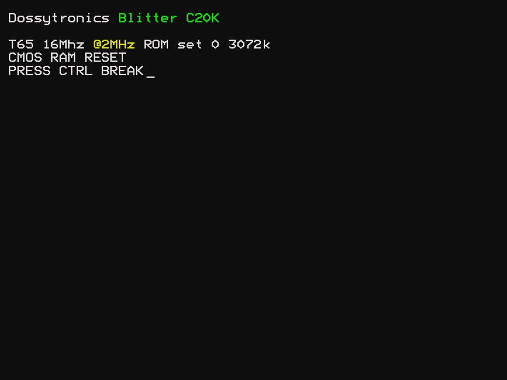

You can now press CTRL-BREAK to get to the normal boot screen.

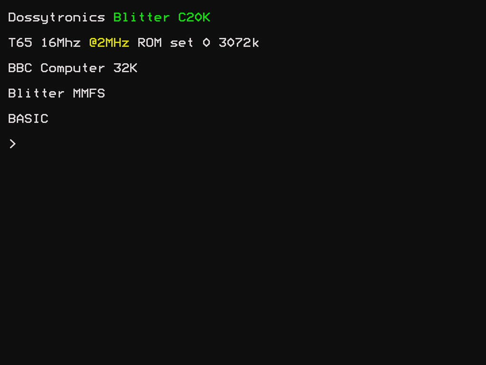

You should then be able type type

    *ROMS

at the command prompt and receive a display of the ROMS in the machine thus:

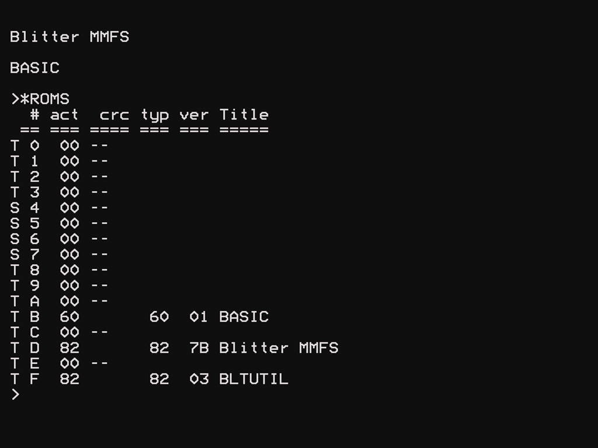

The ROMS that show through in slots #4-#7 would normally should correspond 
to those fitted in the motherboard. (Indicated with an S for System board). 
The other ROMS are all marked as T to show that they are throttled. 

[FIX: On the C20K all ROMS come from the on-board flash and battery backed 
RAM - however the BLTUTIL ROM needs to be updated]

The following sections will discuss loading up the default set of ROMs
you may have been supplied with a board which is pre-loaded with ROMs in 
which case you may want to skip all or part of the following sections.

# Configuration

The C20K allows you to save some configuration to an on board EEPROM and
gives its own versions of \*CONFIGURE and \*STATUS as found on the Master 
series. There are a number of configuration options which may be set and you
can see what is available by typing

    *STATUS

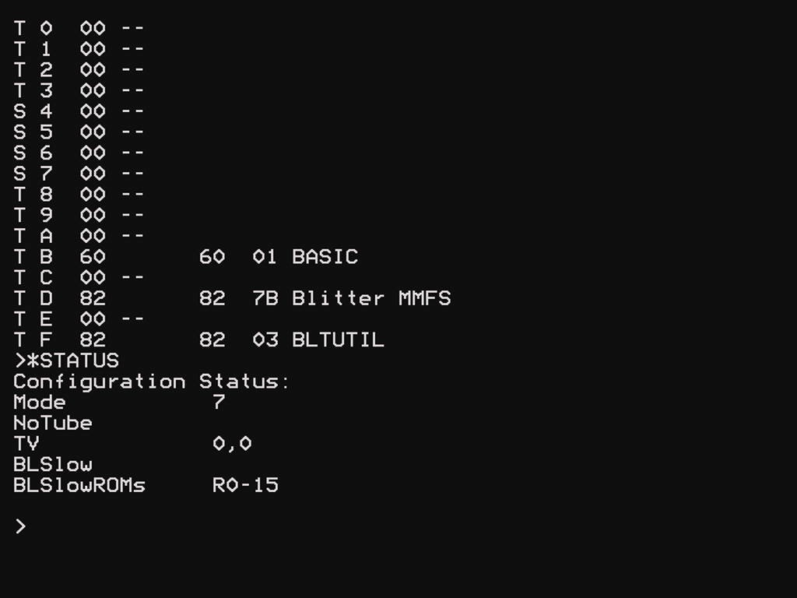

You can set the options with the \*CONFIGURE command - for more information
on the options see the [BLTUTILS documentation](https://github.com/dominicbeesley/blitter-65xx-code/blob/dev-config/doc/bltutil_readme.md#configuration-options)

For now we will turn off the throttling of the CPU and the ROMs using the 
commands:

    *CON. NOBLSLOW
    *CON. BLSLOWROMS -R0-R15
    *STATUS

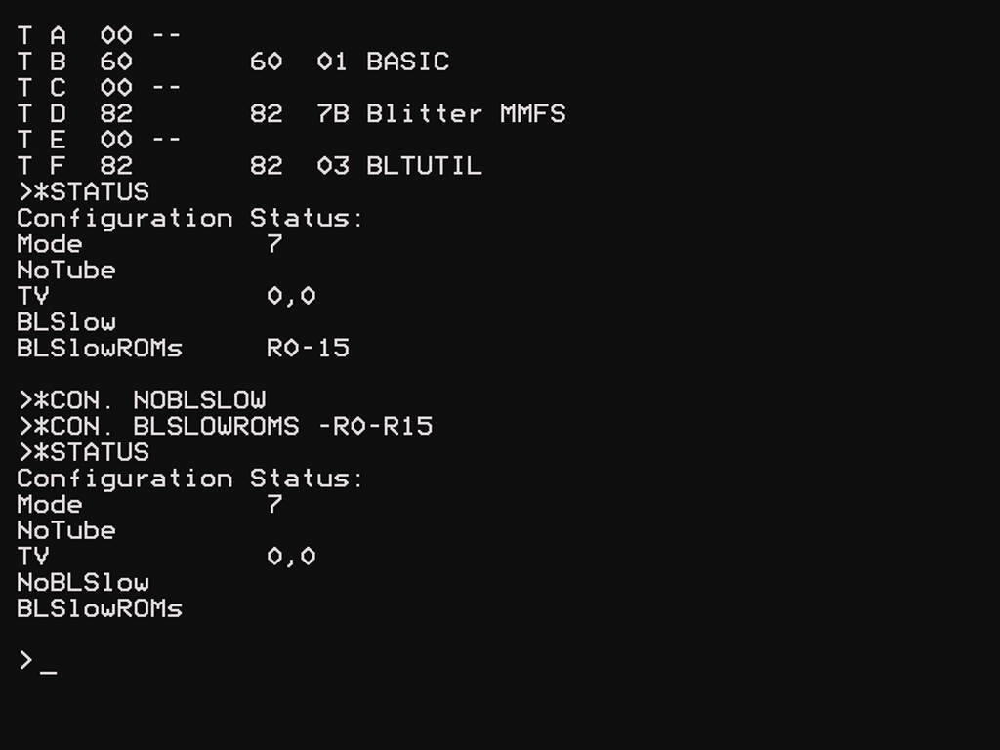

You should now press CTRL-BREAK to update the current settings from the CMOS.

It is usual to have the CPU boot with throttling turned ON so that games will work.

Typing

    *ROMS

will show the ROMs are now no longer all marked with 'T'


# Loading other ROMs

WARNING: The BLTUTIL ROM needs to be updated to properly accommodate the 
C20K. For this reason:
 * Loading ROM images to slots 4-7 isn't currently supported and will fail
 * Loading ROM images to slot 9 is not supported, instead it will overwrite
   the MOS - you will need to follow [Prime Flash](PrimeFlashNoICE.md) to 
   recover.

This section will guide you through loading some ROMs to the slots provided
by the C20K.

When following these examples the syntax of the BLTUTIL ROM utilities can
be found on the [GitHub Wiki](https://github.com/dominicbeesley/blitter-vhdl-6502/wiki/BLTUTIL-Star-Commands)

## Check BLTUTILS is in slot \#F (15)

It is desirable to have the utility ROM be in the highest slot:
 * the NoIce debugger only works in slot F
 * holding down "£" at boot can be used to "catch" corrupted ROMs (see 
   [Troubleshooting](#troubleshooting))
 * The Hazel feature only works on ROM slots with a number below that of the
   BLTUTIL ROM

    *ROMS

Should show

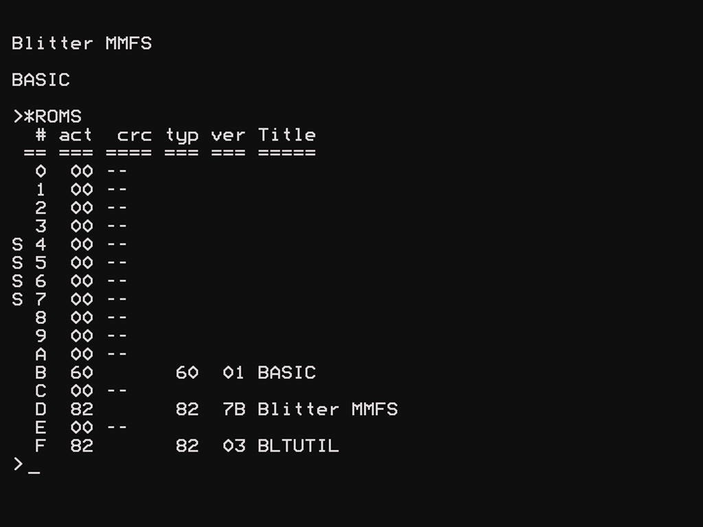

Note: if you attempt to overwrite the current BLTUTIL rom at any time
the load should work but you will not be returned to the command prompt, 
instead the machine will hang after the "...OK" message. This is deliberate
you will need to press CTRL-BREAK to get the MOS to reload the ROMS table.

You can at any time add a parameter "A" to the \*ROMS command and it will
show all the ROMS, even those ignored by the MOS

    *ROMS A

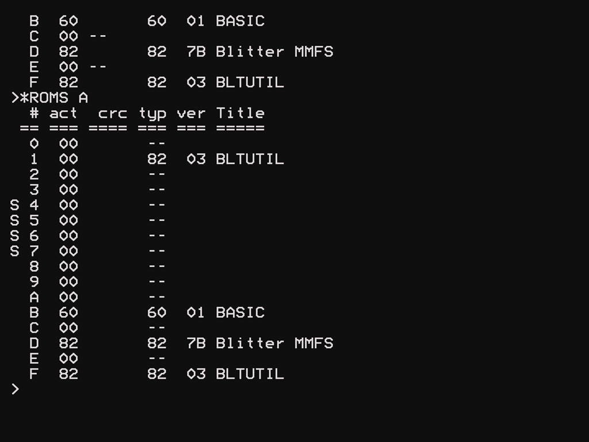

The image above shows a second copy of BLTUTIL ROM has been loaded to slot 1
but has been ignored by the operating system.

There are also options 

  * "V" to show more verbose ROM titles (including version)
  * "C" to show a CRC for each ROM

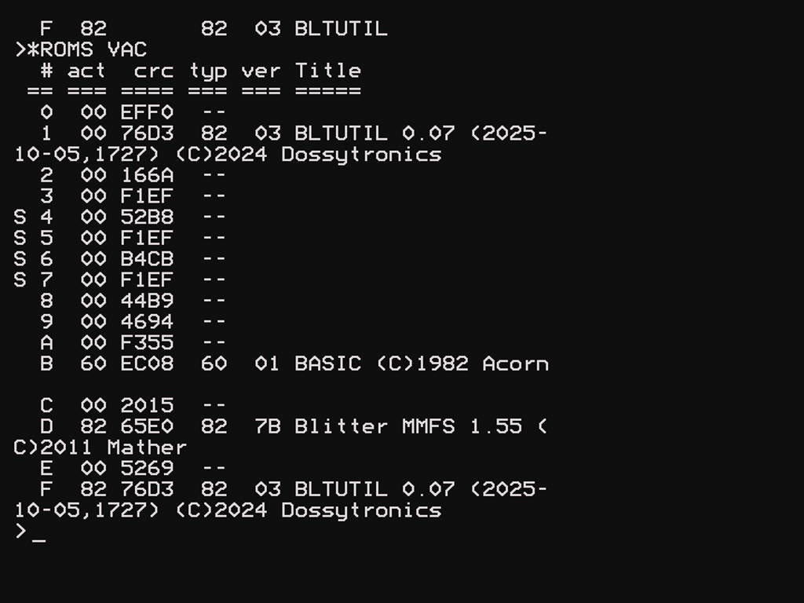

It can be useful to keep a note of ROM CRCs when they are first loaded,
especially to sideways RAM to check for corruption. Here you can see that
the ROMS at #1 and #F have the same CRC.

## ROM Notes

In map 0 (the default map, for alternate map see [Alternate ROM sets](#alternate-rom-sets))
the even numbered slots map to battery backed RAM and odd numbered slots
map to Flash EEPROM. There is little difference between the two except
that RAM is marginally faster but is more susceptible to accidental 
erasure or corruption

## VideoNULA

Some of the demos in this document work best when there is a VideoNULA 
ROM loaded. They use the advanced palette features of the NULA. However, 
the demos will run without the NULA but the colours may be wrong.

You may install it a spare sideways ROM socket. You should insert ROMS65 
image in the current drive and type

    *DIN 500
    *SRLOAD NULA 3

Note: it is worth loading ROM images for frequently used and important
ROMS to odd-numbered sockets or to a motherboard socket (4-7) as the
sideways RAM sockets are more prone to becoming corrupted by errant
software.

# Try out CLOCKSP

You may now check to see the speed of the system, insert the tools65 image
and run:

    *BLTURBO T
    *DIN 501
    CHAIN"CLOCKDP"

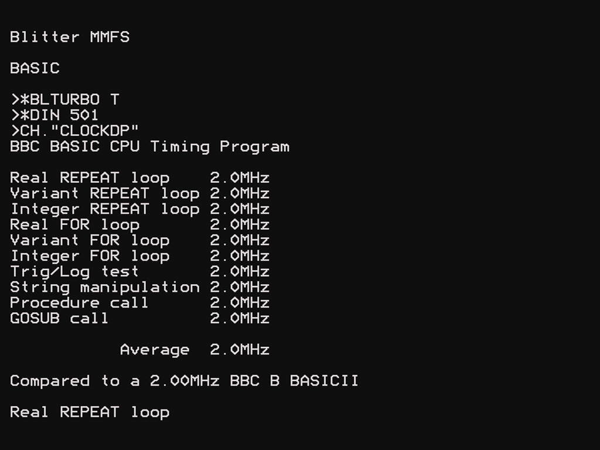

As can be seen this is running at 2.0MHz - this is because we turned on 
throttling of the CPU with the ```BLTURBO T``` command which enables the 
global 2MHz CPU. This mode is usually set as the default using ```*CON. 
BLSLOW``` to ensure backwards compatibility with games and demos.

If we now turn off throttling and rerun the benchmark:

    *BLTURBO -T
    RUN

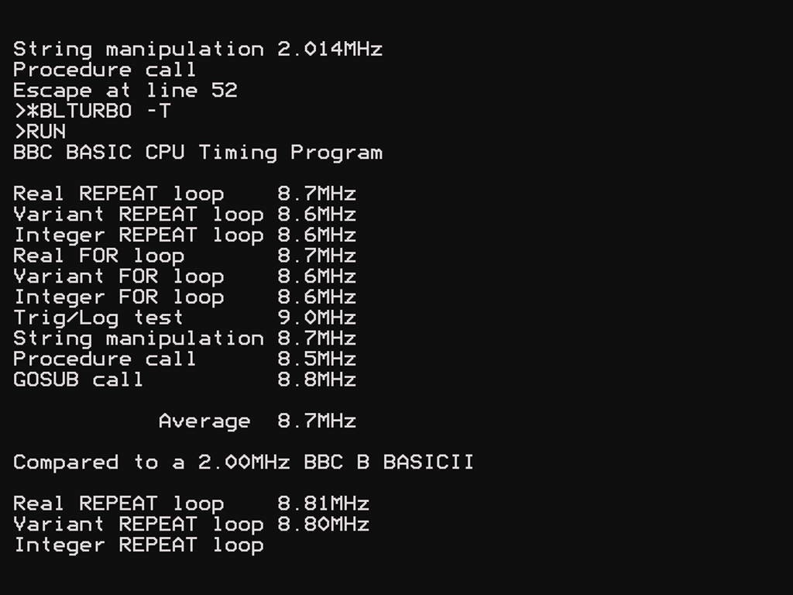


We get roughly 8.8MHz. Even though the T65 core is capable of running at up to 
12MHz(!?check?!) per cycle on this firmware it is being held back to by the 
fact that the BASIC ROM is running from a slower sideways ROM. 

We could make BASIC a little faster by loading the BASIC ROM in to a sideways 
RAM socket E - slot E is special in that it comes from the faster 10ns ChipRAM
but is not backed up by battery:

    *DIN 500
    *SRLOAD BASIC2 E

And press CTRL-Break

    *BLTURBO -T
    *DIN 501
    CHAIN"CLOCKSP"

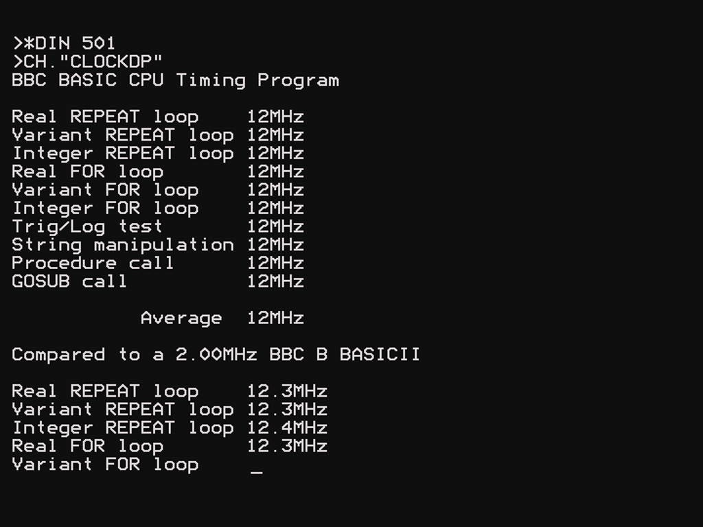

This has got us up to 12.4 MHz but we should be able to do more:

    MODE 7
    *BLTURBO L7F
    HIMEM=&6000
    RUN

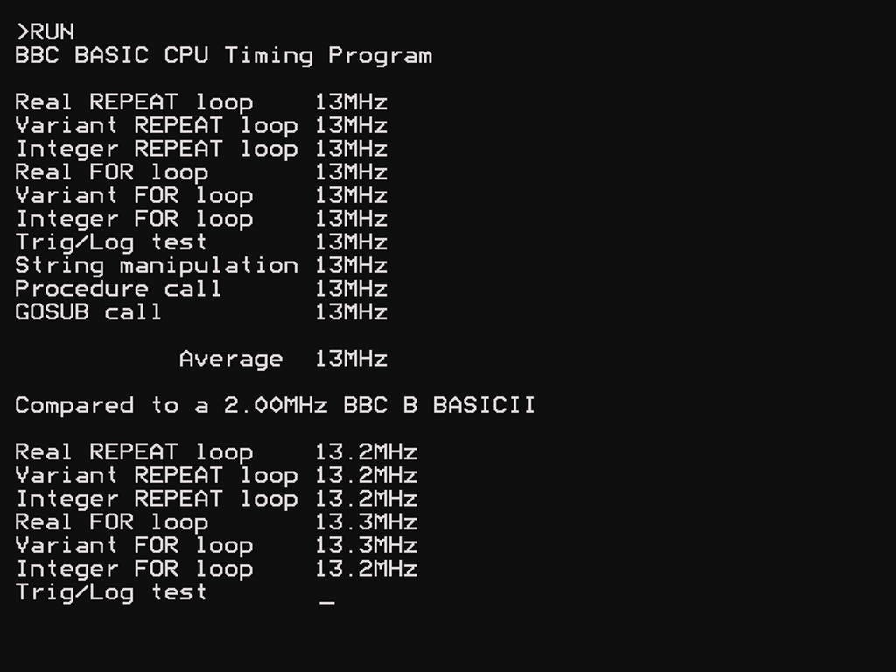

The [BLTURBO Lxx](https://github.com/dominicbeesley/blitter-vhdl-6502/wiki/Command:BLTURBO) 
command with the "L" switch will copy low memory in the range 0..7FFF to 
fast Blitter ChipRAM and then redirect CPU accesses to use this RAM. Each bit
in the number after "L" indicates a block of &1000 that will be redirected so
in our test above the memory 0-6FFF is taken from ChipRAM and 7000-7FFF is
on the motherboard.

The reason we had to switch to MODE 7 is that the MOS is currently unaware of
this remapping and will write any screen bound information to ChipRAM where there
is a remapping. 

The change to HIMEM is to make BASIC place its stack in one of the sped up 
pages.

i.e. switch to MODE 0 and make the top most bank of memory be remapped    

    *BLTURBO L80

You will now need to type blind:

    MODE 0

The mode should change and give some garbage at the bottom. The data that are
being written to 7000-7FFF are now going to ChipRAM instead of the motherboard
so the video system will display the old data. Repeatedly typing

    *HELP

The help information will write correctly to much of the screen but no the 4K
that we have redirected to ChipRAM

    *BLTURBO L00

will restore the screen.

We can have mode 0 work normally *and* have faster basic by using 

    *BLTURBO L07

This will remap 0-2FFF to ChipRAM and leave screen ram at 3000-7FFF pointing at
the motherboard

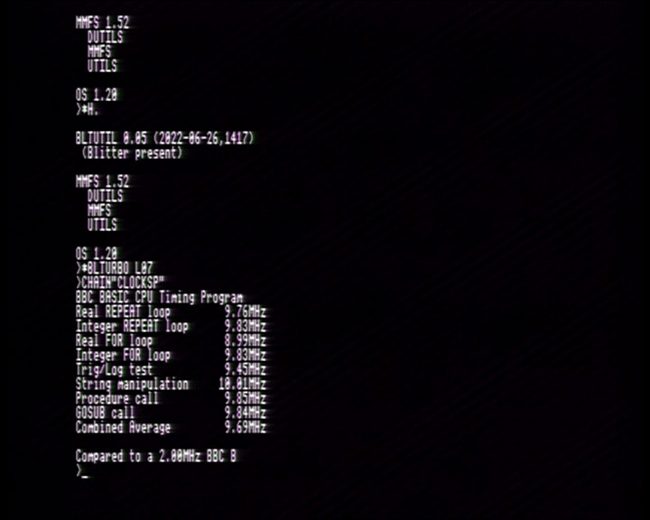

Sometimes it is desirable, when ROMs or RAM is remapped to fast memory to have
the T65 run at a stable 2MHz this can be acheived with:

    *BLTURBO T

This will "throttle" the core such that all memory accesses are synchronised
the motherboard's phi2 clock.

One can type 

    *BLTURBO ?

to query the current settings.


You can also configure this at startup with

    *CON. BLSLOW

or

    *CON. NOBLSLOW

The most sensible default is ```*CON. BLSLOW``` which will allow games and demos
to run as normal.

When you have finished you may wish to erase the Blitter copy of the BASIC2 rom

    *SRERASE E

This command can be used to clear any ROM/RAM slot (including motherboard sockets
where sideways RAM is fitted).

And Ctrl-Break - you may find the machine crashes when deleting the current 
language!


# Testing Sound

The C20K contains a Chipset feature called Paula which is closely modeled on 
the Amiga's Chip of the same name. One of the distinctive features of the 
Paula is that it contains several independent channels which can play sound 
samples at different sample rates. This is in contrast to newer machines
and many older machines such as the Archimedes etc that require complex 
and CPU intensive digital signal processing to play different notes. The
Paula concept is very much suited to 8 bit machines.

Sound output options.
  
    * line-out - this is the 3.5mm jack on the north-west corner pointing 
      towards the rear of the machine - feed this into a sound card or 
      amplifier
    * headphone out - 3.5mm jack to the north-west pointing to the west
      this should suit 32-120ohm headphones. Volume is controlled by
      RV1
    * 3W stereo out - the two JST connectors by the reset switch. Note:
      both speakers must be connected otherwise the driver chip will go
      into shutdown. 3-16ohm speakers 4ohm recommnded,

## Playing some tunes

The paula.ssd demo disk contains a handful of tracker modules and a player.
More mod's are available on stardot.org.uk - as these are quite large it is
recommended that .adl or ADFS disks are used as these allow for much larger
trackers and are many times faster to load. (TODO: investigate ADFS MMFS)

    *DIN 502
    shift-break

You should now be able to select one of the tunes to play - it may take some
time to load.

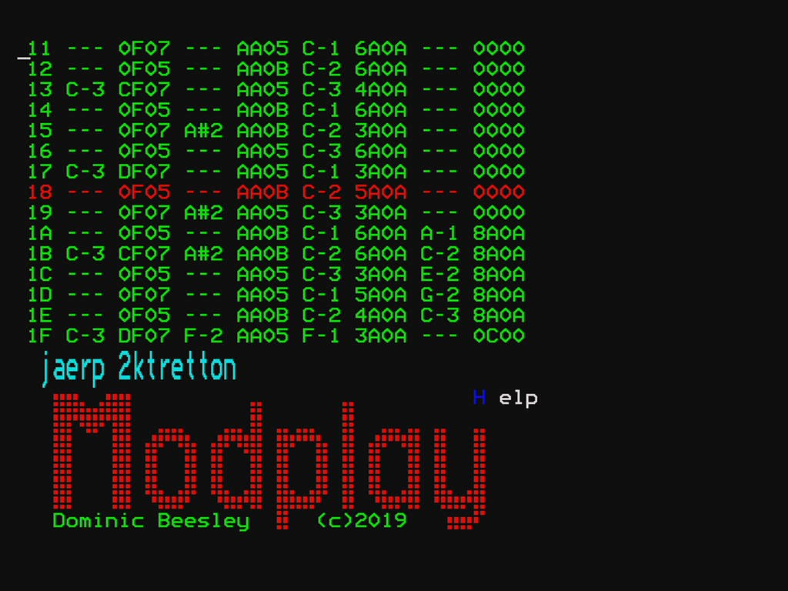

Press H for options or ESCape to stop.

# Blitter

The Blitter Chipset feature is a virtual device for quickly performing
various bitmap operations such as drawing sprites and lines. For more
information see [Chipset](chipset.md#the-blitter)

## Run the demo


    *DIN 503
    shift-break

You should see demo which shows some smoot scrolling of large graphics
at 50 frames a second.

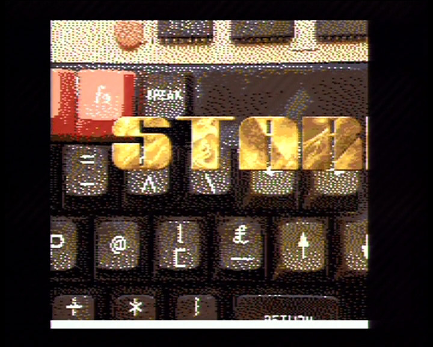


# Aeris

The Aeris is a Chipset feature which is analogous to [Copper](https://second.wiki/wiki/copper_amiga)
chip of the Amiga. It can very quickly perform operations that are
synchronised to the position of the display raster with very little
intervention from the CPU. This can produce some advanced graphics
effects such as palette cycling and vertical rupture whilst leaving 
the CPU free to handle game or demo control logic. 

For more information see [Chipset Aeris](chipset.md#the-aeris)

## Bigfonts demo

The supplied bigfonts.ssd demo shows off some of the capabilities of the 
Aeris by scrolling some large bitmaps (using the Blitter Chipset) and 
doing various palette cycling and poking:
 
 * the outlines of the letters are cycled once per frame to make them
   appear to move at a different speed to the letters
 * the copper bars redefine the palette on each line without CPU 
   intervention
 * the copper bars are redefined also in the middle of the line

To run the demo

    *DIN 504
    shift-break

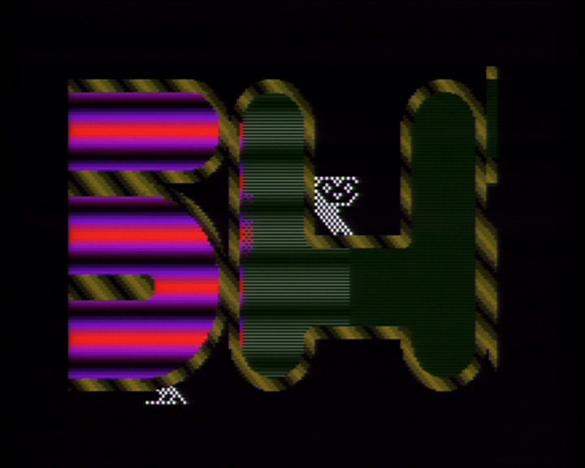

To show how much the Aeris and Blitter can assist with off-loading CPU
processing this demo is written in C, which is relatively slow, and runs the
CPU at 2MHz.

A further demonstration of the Aeris can be had by going back to the 
music player demo above and pressing the 'A' key. The colours of certain
text-columns in mode 7 are used to form a vu-meter.


# Alternate ROM sets

The Blitter provides a second bank of sideways ROM/RAM which may either be
used as an alternate set of ROMs for the T65 core or as a separate set of
ROMs for a hard CPU.

In this section an example will be given of loading up an alternate ROM set.

Before starting please check that your machine is set to run in Map 0 you
should get a boot message like the one in the picture below the important
parts are circled.

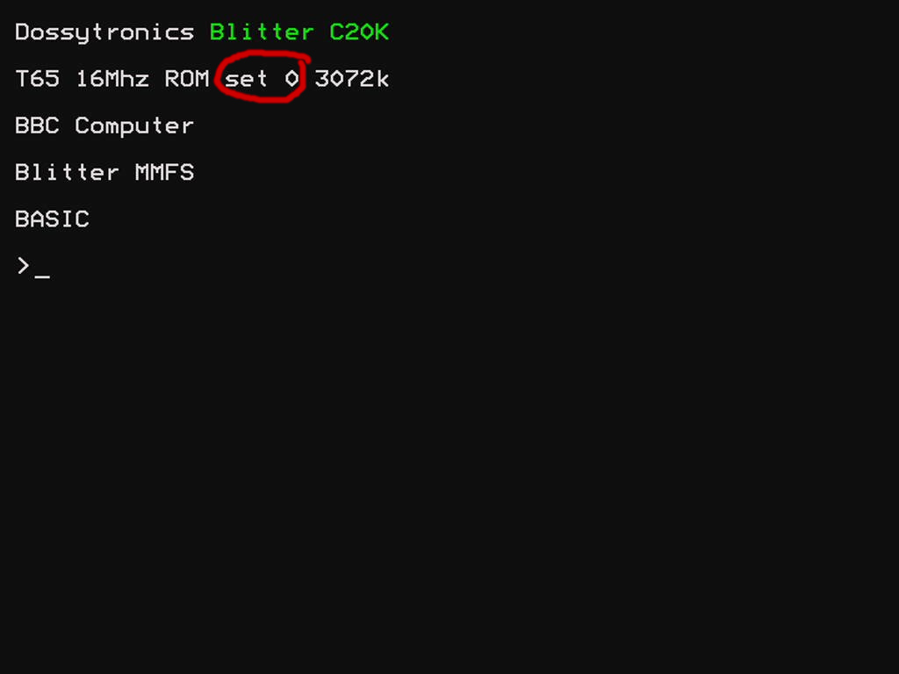


If you don't please check that the jumpers are set follows:

TODO: this should be ok there's no easy way to swap

## Accessing the alternate ROM set

The SRLOAD, SRERASE and ROMS commands all take an optional X switch which
will display the opposite set map to the one currently being accessed by the
CPU. Alternatively the map to use can be explicitly set by adding a 0 or 1 as
the final parameter.

## Check alternate set is blank

Executing the next line when in T65 mode and the SWROMX jumper is not fitted
will list the alternate ROM set from map 1

    *ROMS ACX

This will be equivalent to executing 

    *ROMS AC1


If you have started with a blank blitter board you should get a display like
this:

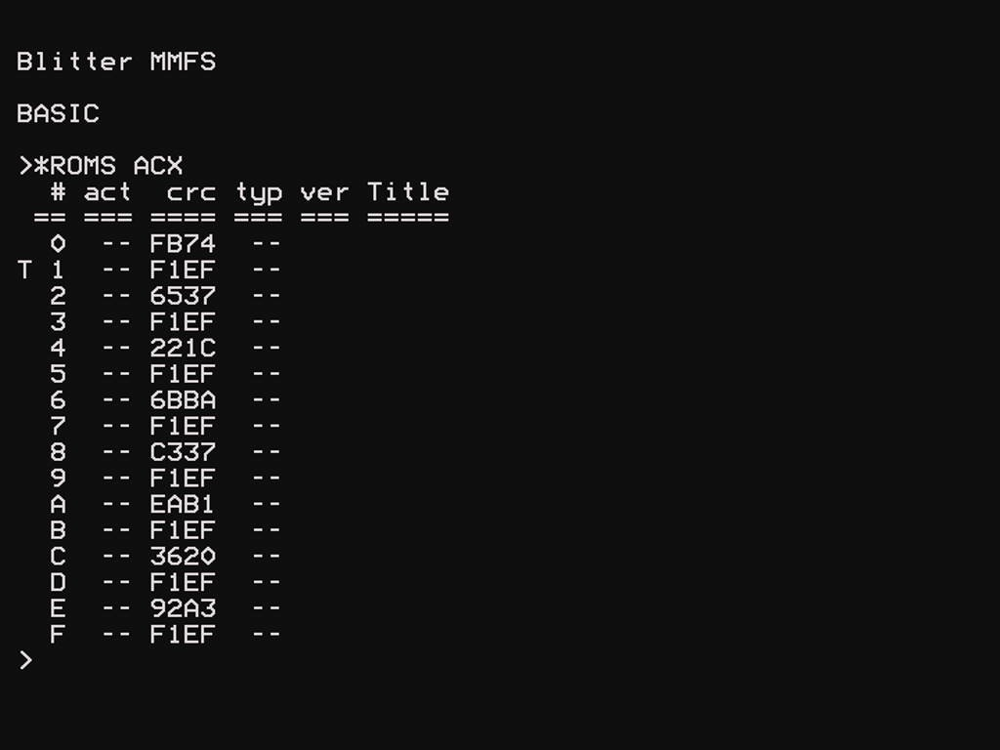

Note: the special CRC F1EF is an indicator that all bytes of the entire 16K 
of each bank is set to the value &FF. [The RAM banks may contain garbage if 
there is no battery backup fitted. It's safe to leave these full of nonsense
so long as they aren't recognised as a ROM by the OS]

If any of the ROM slots is not blank or doesn't have a CRC of F1EF then
type 

    *SRERASE # X

replacing # for the number of the non-blank slot.

## Loading up an alternate ROM set

When the Blitter has an alternate ROM set active not only do the sideways
ROM slots come from the alternate ROM set so does the operating system MOS
ROM. For this reason first we will load up an alternate MOS ROM and try
rebooting.

    *DIN 500
    *SRLOAD M.MOS120 9 X

Rom slot #9 in map 1 has a special purpose as it is the MOS rom slot for
that map and therefore should not be used for loading normal ROM images.

You should now type

    *ROMS ACX

and the CRC for slot #9 should now be 4694 which is the CRC of the MOS 
ROM.

.... More to come ....