> UKWebb - I've thrown this together as a mashup from the other getting started 
guides the screenshots are mostly from different systems so there will be 
differences in the details of the display

> UKWebb - I've burned the SPI-Flash with a reasonably well tested image, we 
may find that we need to re-flash the FPGA at some point but I'll keep that in 
a separate guide which will be included with any future releases.

This guide introduces a few features of the C20K then takes you through some
examples of how to use some of the extended features and how to load new ROMs
etc.

C20K Hardware overview
======================

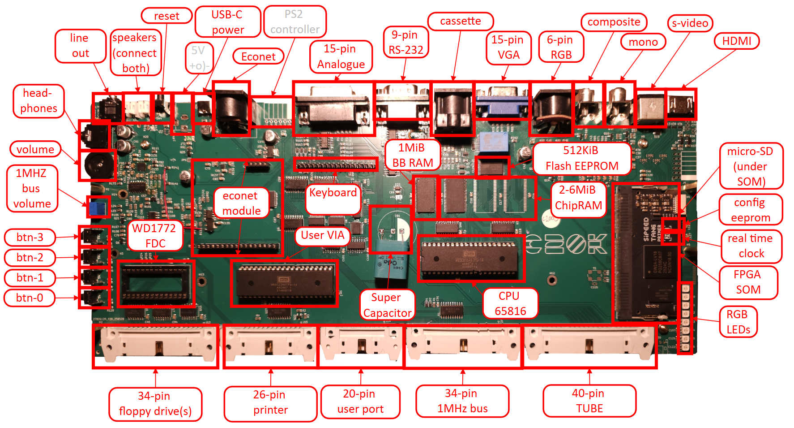

> UKWebb - if there are any connectors, or motherboard features you'd like 
explained let me know and I'll update this guide. I'm sure you can work most of
it out so I'll just try to explain the stuff I think is odd/new.

### RS232

The serial port is at RS232 levels but as the MAX232 is powered from a 3.3V 
supply these are broadly compatible with the RS432 levels of the beeb.

I've gone for the following pinout

| pin # | C20K connection | Usual DCE name | Notes 
|:------|----------------:|---------------:|----------------------------------
|  1    |             n/c | Carrier Detect |
|  2    |              RX |            RXD | Data in to C20K
|  3    |              TX |            TXD | Data out from C20K
|  4    |            link |            DTR | Can link to pin 6 DSR
|  5    |             GND |            GND |
|  6    |            link |            DSR | Can link to pin 4 DTR
|  7    |             RTS |            RTS | 
|  8    |             CTS |            CTS |
|  9    |             n/c |            RI  |

The pins 4 and 6 can be linked together by fitting solder jumper JP4. RTS and 
CTS like on the Beeb have a slightly odd meaning as Acorn used the 6850 in a 
slightly odd way. I've left this as-is so most software should work normally.

> UkWebb, I've fitted JP4 on yours - let me know if you have any problems, I 
seem to have got good results when using null-modem cables to the PC so far

### Video connectors

These can all be used simultaneously though using the 6-pin RGB and VGA sockets
together may cause the levels to drop a little.

#### HDMI

The HDMI outputs 576i/25 and 288p/50 modes depending on interlace setting. You
may find some computer monitors don't like these modes. TV's tend to be more 
ready to accept these modes but computer monitors tend not like anything not
at 60Hz.

> UkWebb, the HDMI socket has a few known problems, it can cause the machine to
fail to boot as it draws a small amount of parasitic power from the attached 
HDMI device, which can confuse the FPGA, if you find you're having trouble let 
me know. I've plans to attempt to do more modes to support more monitors.

#### Monochrome video

This is a standard monochrome output at 75 ohm, with roughly 1V p-p levels.

#### Composite video

This is a PAL colour signal it should be more "standard" then that of the 
BBC B and Master series computers.

> UkWebb, the PAL subcarrier is generated on the FPGA and can cause patterning 
on some monitors. Please feedback if you get problems with this or any 
feedback let me know

#### 6-pin RGB

This should output roughly the same levels as a Model B with a NULA fitted. 
There are 3 solder jumpers JP1-3 which can be altered to slightly raise the
levels which may be needed with some monitors. 

> UkWebb, I've set yours in the East position which should make non-NULA modes
work well on a TTL monitor but might appear a bit dark on an Analogue CUB. I'd
be very interested to hear how it looks on your monitors

#### 15-pin VGA

The current firmware doesn't properly support VGA at present (which would 
require a line-doubler). 

> UkWebb, this connector has been bodged to work with a 15KHz monitor such as 
the Skitphrati but is unlikely to work with much else at present. The HS pin 
carries composite sync, the VS pin is set to '1'. Anything else and the 
Skitphrati monitor is a juddery mess

## Notes on Types of Memory in the C20K

### Video RAM

In normal BBC mode this RAM supplies both the lower 32KiB of RAM that appears
at 0000-7FFF in the 6502/65816 memory map. There is actually more than 32KiB
of RAM which appears in the extended memory map in banks FA and FB. It is 
possible to configure the firmware to "hide" this RAM from the CPU and map 
in other CHIP RAM. In future releases an easier \*SHADOW feature will be 
introduced to allow shadow screen memory and double-buffering. This memory
resides inside the FPGA and may change in the near future to support extended
graphics modes, such as 16-colour mode 0 etc.

### CHIP RAM

This is the larger part of the memory it can be up to 6MiB in size. This memory
is the fastest in the system. This memory can be accessed for programs and data
in 65816 native mode and for graphics and sound by the Blitter/Sound Chipset.

### Battery Backed RAM

There is a 1MiB battery backed RAM chip fitted and a 1 Farad super capacitor.
This can be used to store ROM images (in even numbered slots).

> UkWebb, unfortunately this only seems to give about 3 days of memory 
retention. I'm working on a fix, that's what the horrid long bodge wires are 
but I'm not convinced it's much better. I think in the next re-spin I need find
a less power hungry grade of chip. I suspect I picked "automotive" chips when I
ordered as these are cheaper but need a higher stand-by current

### FPGA Configuration "SPI-Flash"

This holds the VHDL firmware that is loaded to the FPGA to configure its logic.
It also holds the "preboot" rom images and firmware

### Configuration-Flash "CMOS"

This is like the CMOS RAM on a BBC Master / Archimedes. It is 8KiB in size and
can be used to hold a limited amount of configuration information. It is 
normally accessed using \*STATUS and \*CONFIG commands

### Flash EEPROM

This is a large 512KiB EEPROM and is used to hold ROM images that appear in 
odd-numbered ROM slots. Roughly half of the EEPROM is available for end-user
purposes.

## RTC

> UkWebb, there is a small Real Time Clock. This runs off the Super Cap and as
a consequence tends to lose time after a few days. If you prefer it might be
possible to configure the BB RAM to not be battery backed and just run the 
clock off the Super Capacitor


Getting Started - C20K
======================

This guide is intended to guide you through some first steps in using the 
C20k. It is not intended to be a complete reference.

The accompanying disc images are available [here](assets/getting-started/discs.zip) 
an MMB file is also included - it is recommended that that image be used for 
this guide.

> UKWebb - I should have inserted the MMC into the SOM socket! Let me know if
we forget it.

# Preparing the base machine

The C20K should have been provided with a default set of ROMs loaded which will
work for this guide and so the machine shouldn't need any preparation. The 
machine should be configured with enough ROM to complete this guide. However, 
if you should accidentally remove the wrong ROMs or find the machine can't boot 
then you should consult the [Preboot Menu System](#preboot-menu-system) guide 
at the end of this document to reload the ROMs.

If you need to reload the ROMs to complete this guide you should use the set 
labeled "Standard C20K 6502 Guide" as a starting point.

## Filing systems

The C20K in 6502 mode should work with most Model B filing systems *except* for 
unmodified RetroClinic DataCentre board which take over the 1MHz bus JIM 
interface in such a way that is not compatible with the Blitter. An updated
[firmware and ROM is available for the DataCentre](https://github.com/dominicbeesley/DataCentre)

In this guide a MMFS solution is used where the micro SD card should be 
inserted into the slot on the SOM. Other options
that have been widely tested are:
 * ADFS (Disc and Winchester) \[Pi 1MHz not tested\]
 * 1770 DFS
 * 8271 DFS
 * HOSTFS

## MMFS Versions

There are several MMFS versions present on the ROMS65/MMB image:

 * BBLMMFS - MMFS 1 with SD card in SOM module and Hazel E00
 * UBLMMFS - MMFS 1 with SD card in User port and Hazel E00
 * SWMMFS - MMFS 1 to be loaded to a RAM (even numbered slot) E00

You should normally use BBLMMFS with the SOM micro-SD port.

## ADFS

There's a special version of ADFS1.30 provided on the MMB and in the "Big" 
romsets - this uses the auto-Hazel features of the C20K to keep PAGE=&E00. You
may of course use other versions of ADFS that haven't been modified but these
will set PAGE higher.

> UkWebb, other filing systems you use? I've not got round to doing hazel DFS
yet but that is probably the next to tackle.

## MMFS

The commands in the examples below i.e. DIN refer to the MMFS insert disk
command where this command is seen and you are using a different filing 
system then insert the relevant disc using the relevant command or by
inserting the given floppy disc.

# First boot

You should power-up with the R key held down which should reset the 
configuration. Note: this will only work if your BLTUTIL ROM is newer than 
Nov 2024.


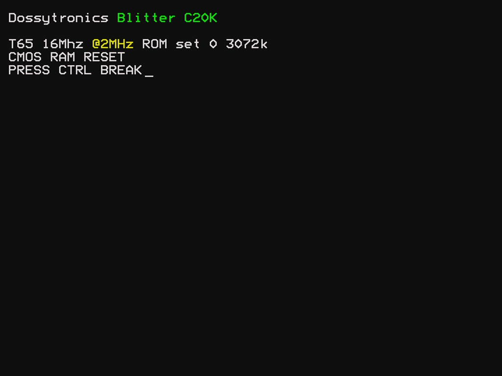

You can now press CTRL-BREAK to get to the normal boot screen.

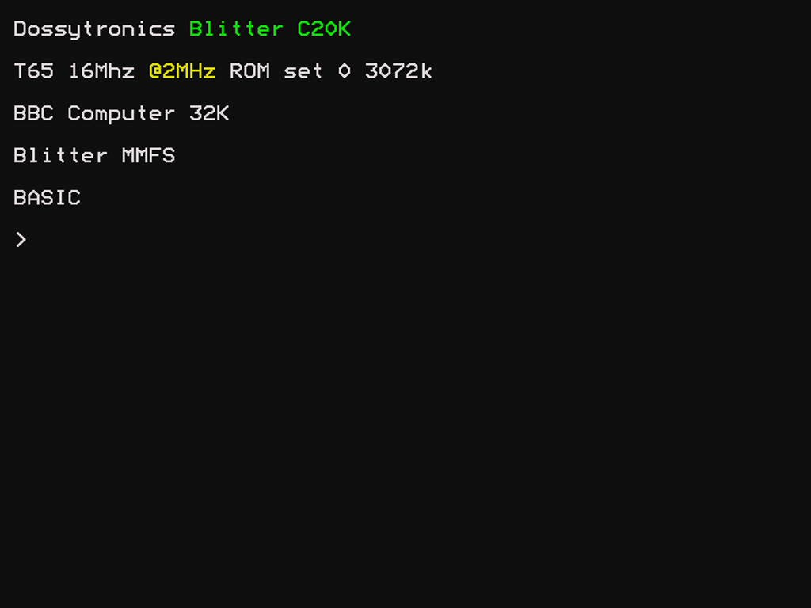

You should then be able type type

    *ROMS

at the command prompt and receive a display of the ROMS in the machine thus:

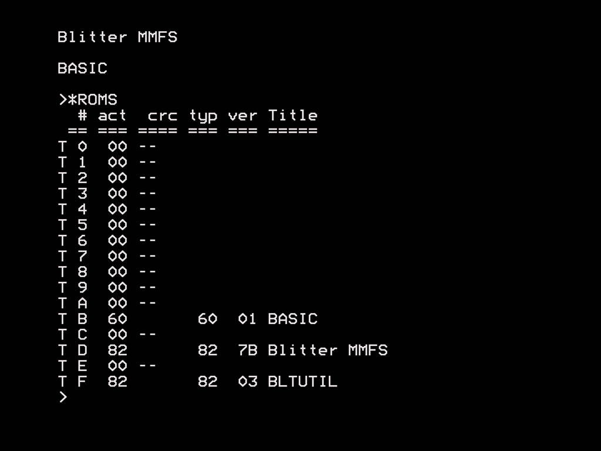

# Configuration

The C20K allows you to save some configuration to an on board EEPROM and
gives its own versions of \*CONFIGURE and \*STATUS as found on the Master 
series. There are a number of configuration options which may be set and you
can see what is available by typing

    *STATUS

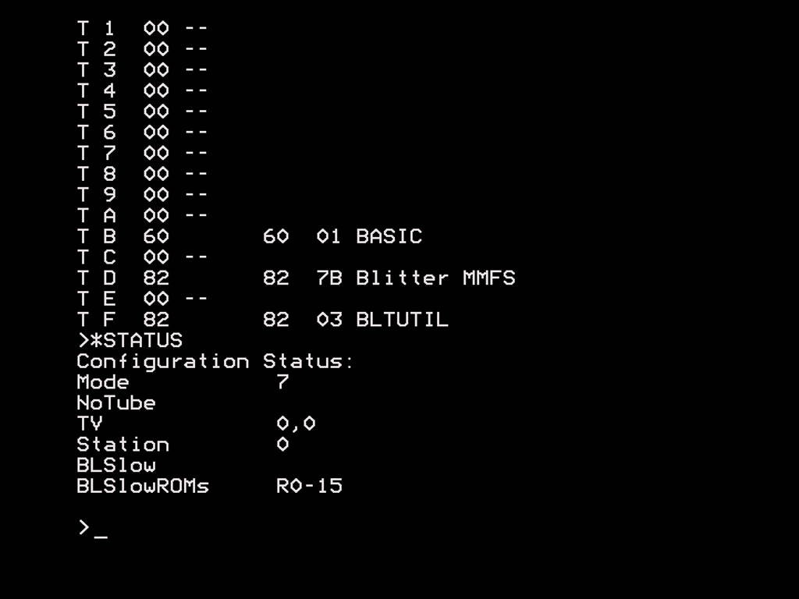

You can set the options with the \*CONFIGURE command - for more information
on the options see the [BLTUTILS documentation](https://github.com/dominicbeesley/blitter-65xx-code/blob/dev-config/doc/bltutil_readme.md#configuration-options)

For now we will turn off the throttling of the CPU and the ROMs using the 
commands:

    *CON. NOBLSLOW
    *CON. BLSLOWROMS -R0-R15
    *STATUS

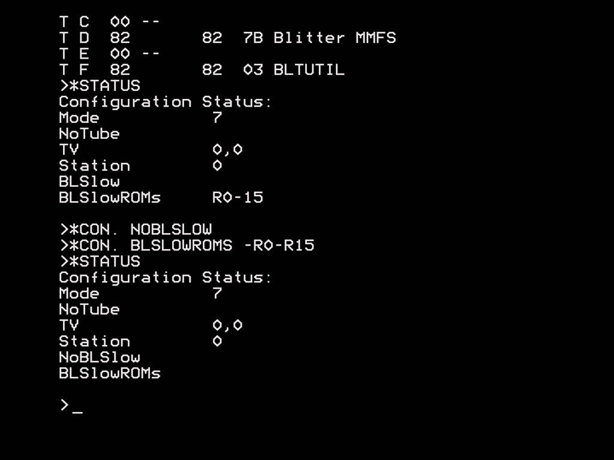

You should now press CTRL-BREAK to update the current settings from the CMOS.

Typing

    *ROMS

will show the ROMs are now no longer all marked with 'T'


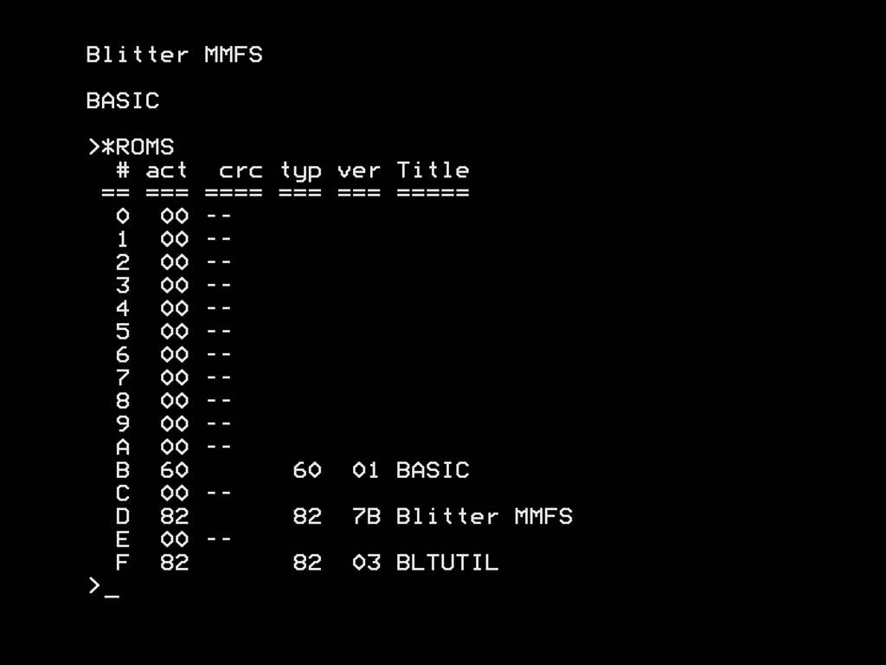


Note: It is usual to have the CPU boot with throttling turned ON so that games 
will work. The throttle option locks the frequency of the CPU to the 2MHz 
signal that a regular Model B's CPU would use. Here we've turned it off at boot
so the CPU will run as fast as it can for now. When you start to use the 
machine normally you'll want to do

    *CON. BLSLOW

to throttle at boot.

However, for now leave it configured run fast at boot.

The BLSLOWROMS option is useful if you find there are ROMs that crash or
misbehave when throttling is turned off. This can be used to throttle those
particular ROMs despite other ROMs running at full speed. For instance th
normal MMFS ROM for the user-port contains timing loops that don't work
correctly at 8MHz. So, if you wish to use the user port MMC it will be 
necessary to throttle that ROM, for instance if MMFS was in slot 3:

    *CON. BLSLOWROMS R3

# Loading other ROMs

WARNING: The BLTUTIL ROM needs to be updated to properly accommodate the 
C20K. For this reason:
 * Loading ROM images to slot 9 is not supported, instead it will overwrite
   the MOS - you will need to follow 
   [Preboot Menu System](#preboot-menu-system) to recover.

This section will guide you through loading some ROMs to the slots provided
by the C20K from the filing system.

When following these examples the syntax of the BLTUTIL ROM utilities can
be found on the [GitHub Wiki](https://github.com/dominicbeesley/blitter-vhdl-6502/wiki/BLTUTIL-Star-Commands)

## Check BLTUTILS is in slot \#F (15)

It is desirable to have the utility ROM be in the highest slot:
 * holding down "£" at boot can be used to "catch" corrupted ROMs (see 
   [Troubleshooting](#troubleshooting))
 * The Hazel feature only works on ROM slots with a number below that of the
   BLTUTIL ROM
```
   *ROMS
```
Should show


Note: if you attempt to overwrite the current BLTUTIL ROM at any time
the load should work but you will not be returned to the command prompt, 
instead the machine will hang after the "...OK" message. This is deliberate
you will need to press CTRL-BREAK to get the MOS to reload the ROMS table.

You can at any time add a parameter "A" to the \*ROMS command and it will
show all the ROMS, even those ignored by the MOS

    *ROMS A

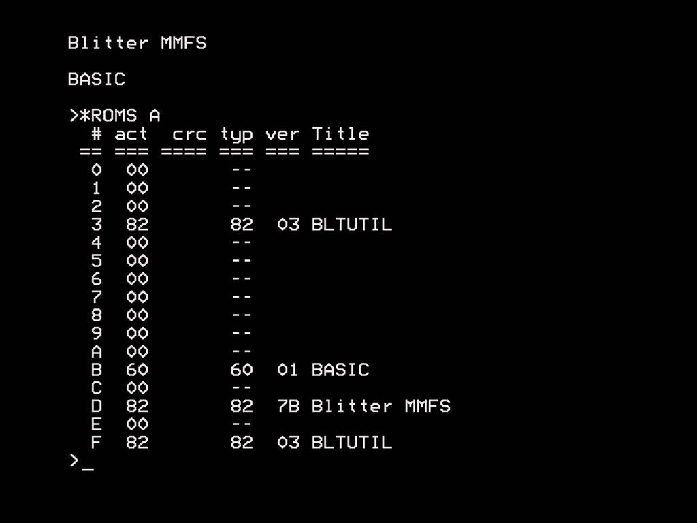

The image above shows a second copy of BLTUTIL ROM has been loaded to slot 1
but has been ignored by the operating system.

There are also options 

  * "V" to show more verbose ROM titles (including version)
  * "C" to show a CRC for each ROM

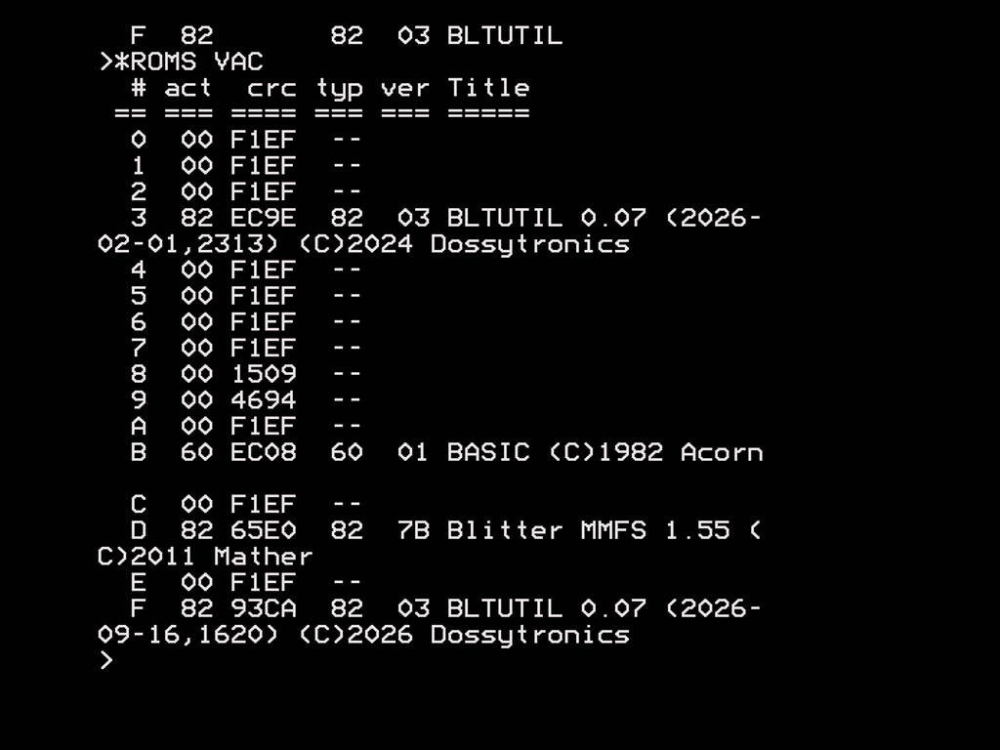

It can be useful to keep a note of ROM CRCs when they are first loaded,
especially to sideways RAM to check for corruption. Here you can see that
the ROMS at #1 and #F have different CRCs and are different versions of the
same ROM.

It's worth noting that BASIC2 has a CRC of EC08 and MOS 1.20 has a CRC of 4694
- the MOS is usually loaded from SLOT #9 on the C20K, or from slot #8 if the
MOSRAM button is held down at boot see [Extra buttons](#extra-buttons)

## ROM Notes

On the C20K slot #E (14) maps to ChipRAM, other even numbered slots map to 
battery backed RAM and odd numbered slots map to Flash EEPROM. There is little
difference between the two except that RAM is faster but is more susceptible 
to accidental erasure or corruption.

> UkWebb, the current firmware the Flash memory runs at 4MHz in 6502 emulation
mode - I'm aiming to get it running at 8MHz in which case there will be no
difference in speed between RAM and Flash. I'd be interested if you have any
opinion on how to arrange Flash vs BB Ram, I went odd-even and it kind of stuck
but maybe there's a better plan? I'll probably get rid of slot #E being
different at some point soon.

## Load VideoNULA ROM

Some of the demos in this document work best when there is a VideoNULA 
ROM loaded. They use the advanced palette features of the NULA. However, 
the demos will run without the NULA but the colours may be wrong.

You may install it a spare sideways ROM socket. You should insert ROMS65 
image in the current drive and type

    *DIN 500
    *SRLOAD NULA 3

Note: it is worth loading ROM images for frequently used and important
ROMS to odd-numbered sockets as the sideways RAM sockets are more prone
to becoming corrupted by errant software or battery failure.

# Try out CLOCKSP

You may now check to see the speed of the system, insert the tools65 image
and run:

    *BLTURBO T
    *DIN 501
    CHAIN"CLOCKDP"

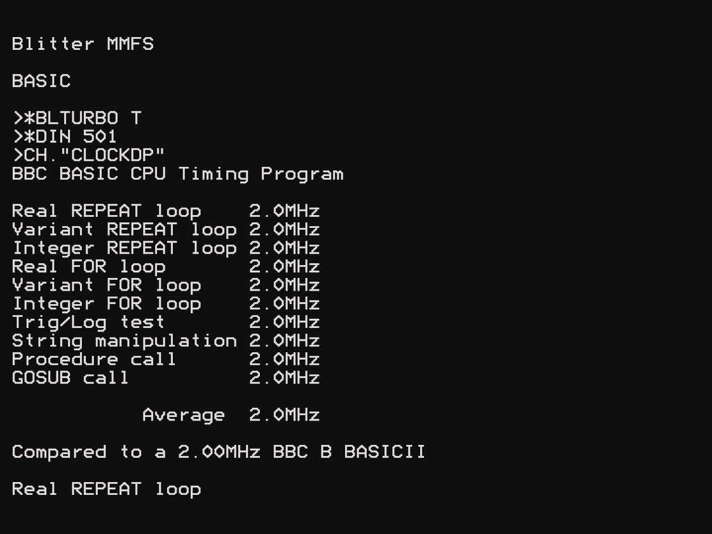

As can be seen this is running at 2.0MHz - this is because we turned on 
throttling of the CPU with the ```BLTURBO T``` command which enables the 
global 2MHz CPU. This mode is usually set as the default using ```*CON. 
BLSLOW``` to ensure backwards compatibility with games and demos.

If we now turn off throttling and rerun the benchmark:

    *BLTURBO -T
    RUN

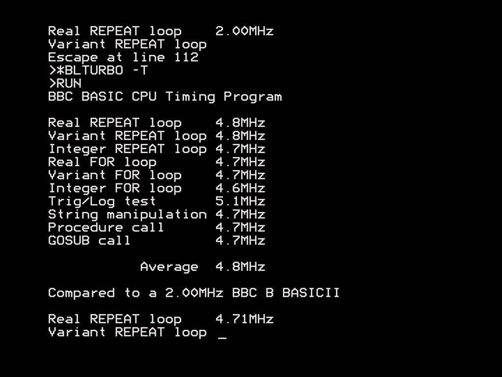


We get roughly 4.8MHz. Even though the T65 core is capable of running at up to 
8MHz per cycle on this firmware it is being held back to by the fact that the 
BASIC ROM is running from a slower sideways ROM. 

We could make BASIC a little faster by loading the BASIC ROM in to a sideways 
RAM socket E - slot E is special in that it comes from the faster 10ns ChipRAM
but is not backed up by battery:

    *DIN 500
    *SRLOAD BASIC2 E

And press CTRL-Break

    *BLTURBO -T
    *DIN 501
    CHAIN"CLOCKDP"


This has got us up to 8.0 MHz. 

We will see later that things are slightly different when running in 65816
mode.

# 65816 mode

We'll now try to boot into 65816 mode. Before we try this we should check the
other ROM map. On the C20K there are two ROM maps 0 and 1. In normal operation
all the ROMs for the T65 core (NMOS 6502 emulation) come from map 0 - which
we've been using until now. All the ROMs for 65816 come from map 1. We can list
the ROMs for the other map using

    *ROMS VACX


The "X" (for exchange) shows the other map's ROMS we could also do 
```*ROMS VAC1```

If your romset for map 1 doesn't look like the listing above then use the 
[Preboot Menu System](#preboot-menu-system) to load the standard set to map 1 -
don't forget you may need to erase map 1 first.

We can now boot to 65816 mode, to do so hold down the rear-most button on the
left hand side of the C20K whilst either clicking the reset button (next to the
power inlet) or holding down BREAK for 3 seconds. You should now be rebooted 
into 65816 mode:

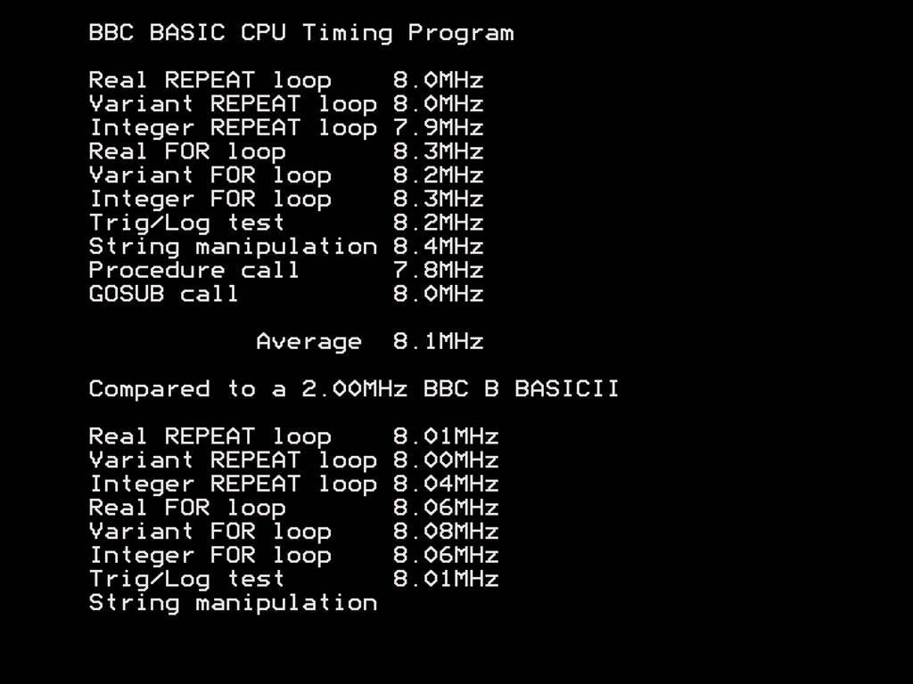

See that the boot message now says "65816 8MHz ROMS set 1".

Note: if this is the first time you've done this and find the screen is rolling
you may need to press CTRL-R-BREAK to reset the CMOS.

You should, once again, ensure that fast mode is enabled at boot for these 
tests:

    *CON. BLNOSLOW
    *CON. BLSLOWROMS -R0-R15

An remember, the ROM maps and configuration are per-map.

It is possible to "swap maps" by holding down button 1 on the left of the C20K
whilst performing a power-up, reset (button next to power), or long-BREAK. 

Note: button 1 is the 2nd from the front (the front most being button 0)

If you want the 65816 to use map 0, for instance, hold down buttons 1 and 3 and
do a long-BREAK:

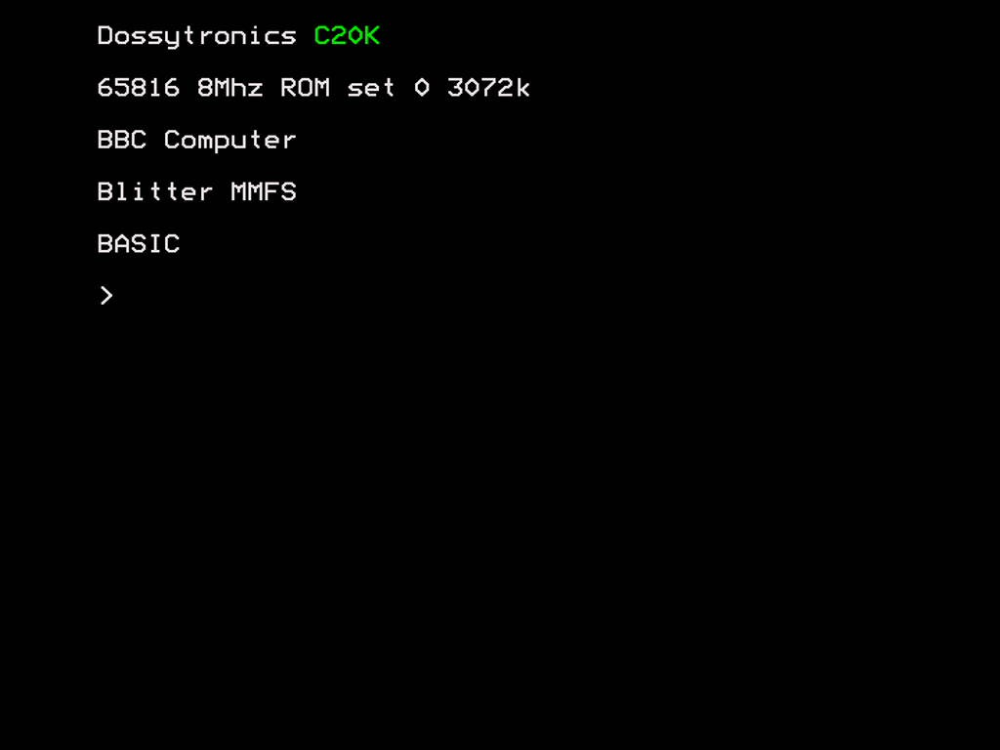

This shows we now have the 65816 CPU running and map 0 is active.

Please return to map 1 and 65816 for the remaining tests...hold down button 3
and do a long break, you should be back to:


We are now running the 65816 in turbo mode. Let's run clock speed again.

    *DIN 501
    CH."CLOCKDP"


This gives us a rough speed of 6.4MHZ, but the 816 is running at 8MHz. This
time it's the video memory that is running slightly slower. Like the Beeb
the C20K uses video memory for the first 32K of memory by default. Because
video memory is shared with the actual video system it is "contended". At
present the CPU can access this memory at roughly 4MHz.

Note: The 65816 *can* access the Flash ROM at full 8MHz speed, unlike the t65
core.

We can map the first 32K if memory in 4K segments to run from ChipRAM

    MODE 7
    *BLTURBO L7F
    HIMEM=&6000
    RUN

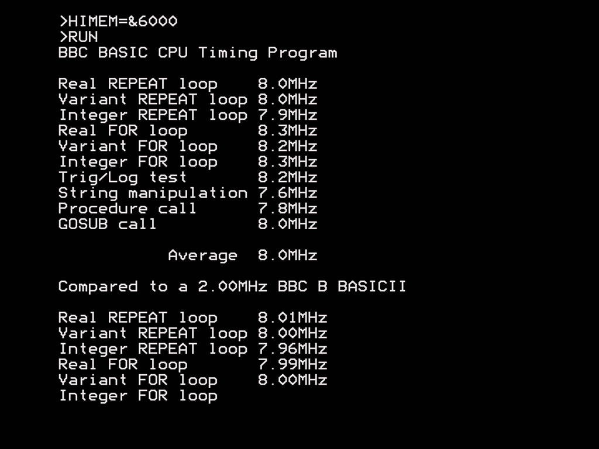

The [BLTURBO Lxx](https://github.com/dominicbeesley/blitter-vhdl-6502/wiki/Command:BLTURBO) 
command with the "L" switch will copy low memory in the range 0..7FFF to 
fast Blitter ChipRAM and then redirect CPU accesses to use this RAM. Each bit
in the number after "L" indicates a block of &1000 (4KiB) that will be 
redirected so in our test above the memory 0-6FFF is taken from ChipRAM and
7000-7FFF is on the motherboard. For MODE 7 this leaves the top 4K running
from video memory.

The ```HIMEM=``` statement makes sure that BASIC stores its seconday stack
in the fast memory. In MODE 7 this would normally be a t &7C00 downwards.


> UkWebb: For the C20K at the moment the video memory is not much slower than
ChipRAM so this is all a bit academic. However, it is planned to add some
higher-resolution modes which may make the video RAM effectively run slower as
it will be in contention with the video system. On the Blitter boards the 
video RAM is at a maximum of 2MHz when accessed by the CPU.

> UkWebb: The Master has ```*SHADOW``` and related OS calls - this is under 
consideration for the C20K but so far I've tried to keep everything running on
MOS120 and this rather shonky BLTURBO was the compromise, but in practice its
all a bit meh. I'm winding myself to have a look at doing a reassembly of the
MOS120 to move all the graphics stuff to be earlier in the ROM so it can work
like the Master and page shadow memory for code that runs in the first part of
the MOS.

> UkWebb, For now I've stuck with BBC B hardware addresses and OS code - this 
is supposed to be the Model B upgrade that the Master should have been. One of 
my disappointments BITD was that my games didn't work on the master, which is 
why I've gone down this route. I'm starting to feel this is a bit restrictive
though and might "give in" and make it all a bit more Mastery...what do you 
think?

The reason we had to switch to MODE 7 is that the MOS is currently unaware of
this remapping and will write any screen bound information to ChipRAM where 
there is a remapping. 

i.e. switch to MODE 0 and make the top most bank of memory be remapped    

    *BLTURBO L80

You will now need to type blind:

    MODE 0

The mode should change and give some garbage at the bottom. The data that are
being written to 7000-7FFF are now going to ChipRAM instead of the motherboard
so the video system will display the old data. Repeatedly typing

    *HELP
    *HELP
    *HELP
    *HELP

The help information will write correctly to much of the screen but no the 4K
that we have redirected to ChipRAM

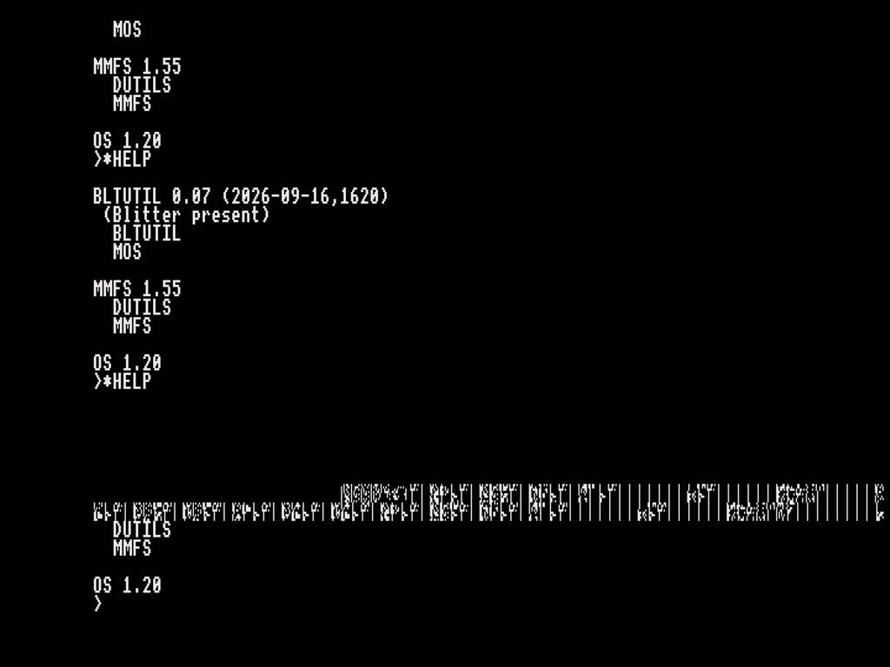

We can have mode 0 work normally *and* have faster basic by using 

    *BLTURBO L07

This will remap 0-2FFF to ChipRAM and leave screen ram at 3000-7FFF pointing at
the motherboard

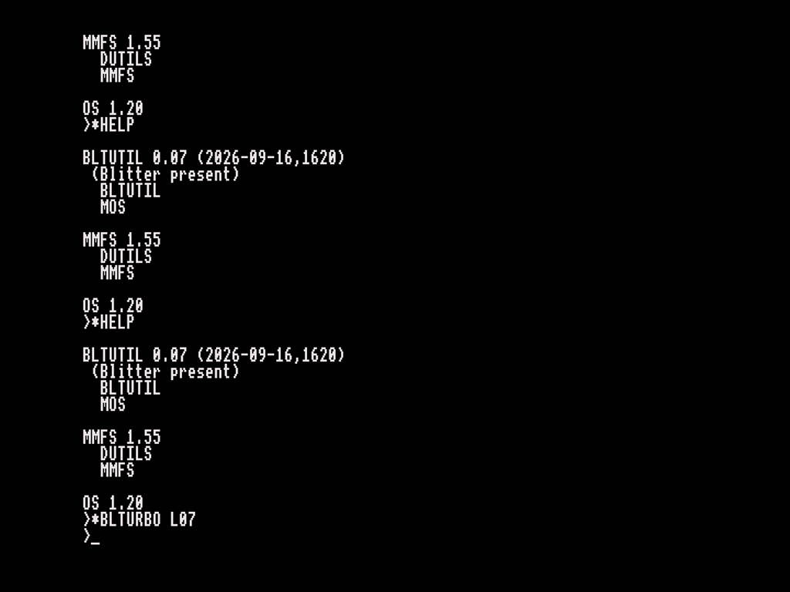

Oftentimes it is desirable, when ROMs or RAM is remapped to fast memory to have
the T65 run at a stable 2MHz this can be acheived with:

    *BLTURBO T

This will "throttle" the core such that all memory accesses are synchronised
the motherboard's phi2 clock.

One can type 

    *BLTURBO ?

to query the current settings.

You can also configure this at startup with

    *CON. BLSLOW

or

    *CON. NOBLSLOW

The most sensible default is ```*CON. BLSLOW``` which will allow games and
demos to run as normal.

When you have finished you may wish to erase the Blitter copy of the BASIC2 rom

    *SRERASE E
    *SRERASE EX

This command can be used to clear any ROM/RAM slot (including motherboard
sockets where sideways RAM is fitted).

And Ctrl-Break - you may find the machine crashes when deleting the current 
language!


# Testing Sound

The C20K contains a Chipset feature called Paula which is closely modeled on 
the Amiga's Chip of the same name. One of the distinctive features of the 
Paula is that it contains several independent channels which can play sound 
samples at different sample rates. This is in contrast to newer machines
and many older machines such as the Archimedes etc that require complex 
and CPU intensive digital signal processing to play different notes. The
Paula concept is very much suited to 8 bit machines.

Sound output options.
  
    * line-out - this is the 3.5mm jack on the north-west corner pointing 
      towards the rear of the machine - feed this into a sound card or 
      amplifier
    * headphone out - 3.5mm jack to the north-west pointing to the west
      this should suit 32-120ohm headphones. Volume is controlled by
      RV1
    * 3W stereo out - the two JST connectors by the reset switch. *Note:
      both speakers must be connected* otherwise the driver chip will go
      into shutdown. 3-16ohm speakers 4ohm recommnded for loudest sound!

## Playing some tunes

The paula.ssd demo disk contains a handful of tracker modules and a player.
More mod's are available on stardot.org.uk - as these are quite large it is
recommended that .adl or ADFS disks are used as these allow for much larger
trackers and are many times faster to load. (TODO: investigate ADFS MMFS)

    *DIN 502
    shift-break

You should now be able to select one of the tunes to play - it may take some
time to load.

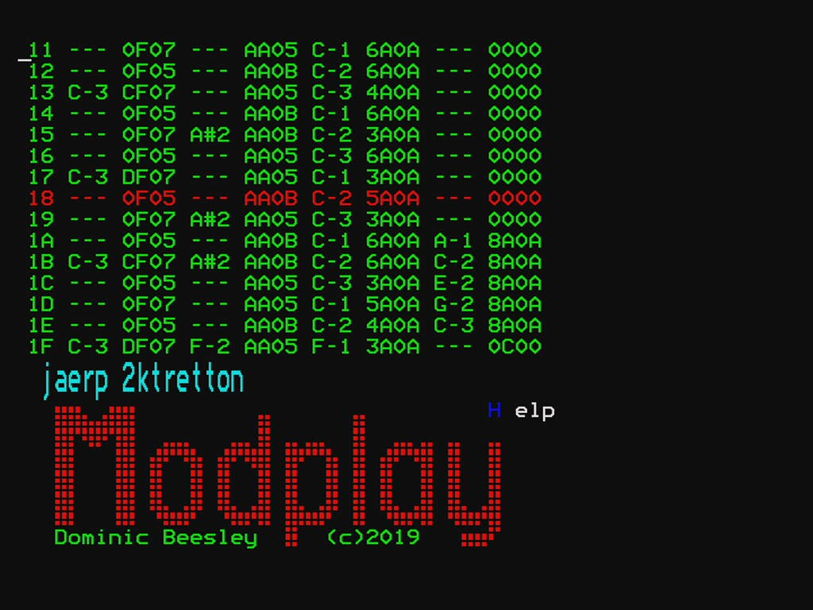

Press H for options or ESCape to stop.

Note: If you have problems or the tune plays weirdly check that the BLTURBO
low-memory is set to L00:

    *BLTURBO ?

If L is no L00 then:

    *BLTURBO L00

This is a problem with the MODPLAY demo program which doesn't take into account
the turbo setting and blindly uses video memory. This may be fixed in future.

# Blitter

The Blitter Chipset feature is a virtual device for quickly performing
various bitmap operations such as drawing sprites and lines. For more
information see [Chipset](chipset.md#the-blitter)

## Run the demo


    *DIN 503
    shift-break

You should see demo which shows some smooth scrolling of large graphics
at 50 frames a second.

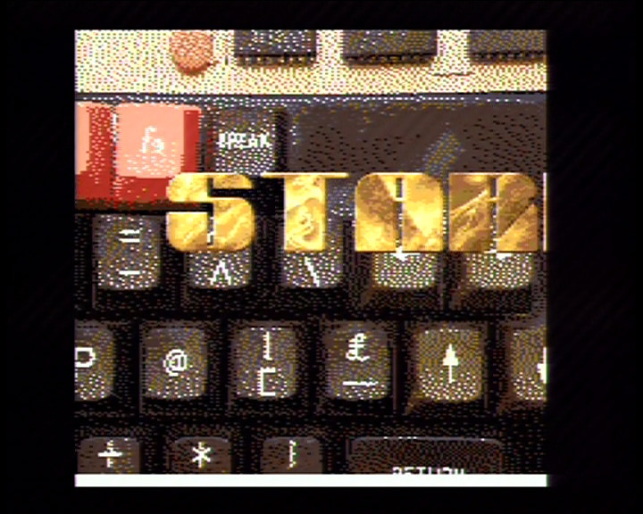


# Aeris

The Aeris is a Chipset feature which is analogous to [Copper](https://second.wiki/wiki/copper_amiga)
chip of the Amiga. It can very quickly perform operations that are
synchronised to the position of the display raster with very little
intervention from the CPU. This can produce some advanced graphics
effects such as palette cycling and vertical rupture whilst leaving 
the CPU free to handle game or demo control logic. 

For more information see [Chipset Aeris](chipset.md#the-aeris)

## Bigfonts demo

The supplied bigfonts.ssd demo shows off some of the capabilities of the 
Aeris by scrolling some large bitmaps (using the Blitter Chipset) and 
doing various palette cycling and poking:
 
 * the outlines of the letters are cycled once per frame to make them
   appear to move at a different speed to the letters
 * the copper bars redefine the palette on each line without CPU 
   intervention
 * the copper bars are redefined also in the middle of the line

To run the demo

    *DIN 504
    *SRLOAD R.CLIB 1
    shift-break

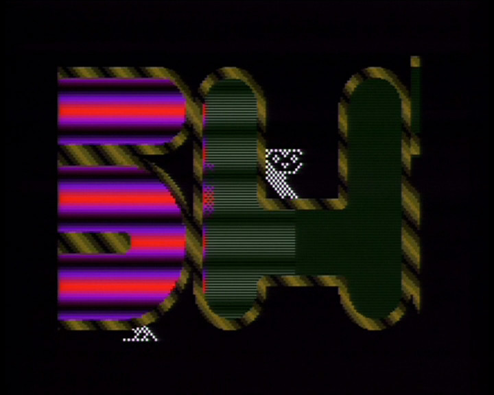

To show how much the Aeris and Blitter can assist with off-loading CPU
processing this demo is written in C, which is relatively slow, and runs the
CPU at 2MHz.

A further demonstration of the Aeris can be had by going back to the 
music player demo above and pressing the 'A' key. The colours of certain
text-columns in mode 7 are used to form a vu-meter.


# Alternate ROM sets

As noted earlier it is possible to load ROMs to an alternate "map". In this 
section an example will be given of loading up an alternate ROM set.

Before starting please check that your machine is set to run as t65 in Map 0 
you should get a boot message like the one in the picture below the important
parts are circled.

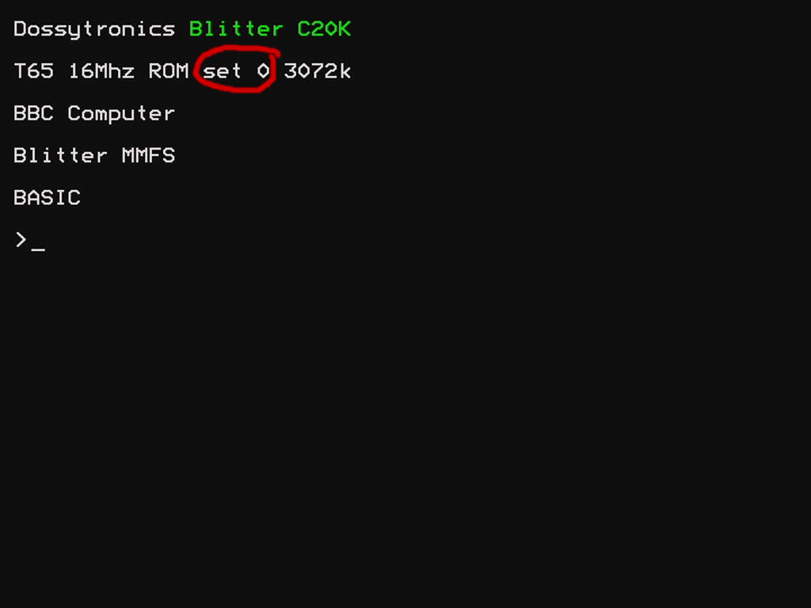


If you don't please hold down BREAK for 3 seconds with no buttons held on the
left.

## Accessing the alternate ROM set

The SRLOAD, SRERASE and ROMS commands all take an optional X switch which
will display the opposite set map to the one currently being accessed by the
CPU. Alternatively the map to use can be explicitly set by adding a 0 or 1 as
the final parameter.

### Check alternate set is blank

Before following this part of the guide you should erase map 1. You can
use either the [Preboot Menu System](#preboot-menu-system). 

    CTRL-DEL-BREAK
    select "Clear Memory"
    select "1" for map 1
    select "B" for both BB ram and Flash ROM
    select "Y" to continue
    select "Reboot"

### List alternate ROMs

Executing the next line when in T65 mode in map 0 will list the alternate ROM 
set from map 1

    *ROMS ACX

This will be equivalent to executing 

    *ROMS AC1


If you have started with a blank map 1 you would get:


Note: the special CRC F1EF is an indicator that all bytes of the entire 16K 
of each bank is set to the value &FF. [The RAM banks may contain garbage if 
there is no battery backup fitted. It's safe to leave these full of nonsense
so long as they aren't recognised as a ROM by the OS]

If any of the ROM slots is not blank or doesn't have a CRC of F1EF then
type 

    *SRERASE # X

replacing # for the number of the non-blank slot.

## Loading up an alternate ROM set

When the Blitter has an alternate ROM set active not only do the sideways
ROM slots come from the alternate ROM set so does the operating system MOS
ROM. For this reason first we will load up an alternate MOS ROM and try
rebooting.

    *DIN 500
    *SRLOAD M.MOS120 9 X

Rom slot #9 in map 1 has a special purpose as it is the MOS rom slot for
that map and therefore should not be used for loading normal ROM images.

You should now type

    *ROMS ACX

and the CRC for slot #9 should now be 4694 which is the CRC of the MOS 
ROM.

If you were to boot to 65816 - hold button 3, long BREAK - mode now you would 
get:


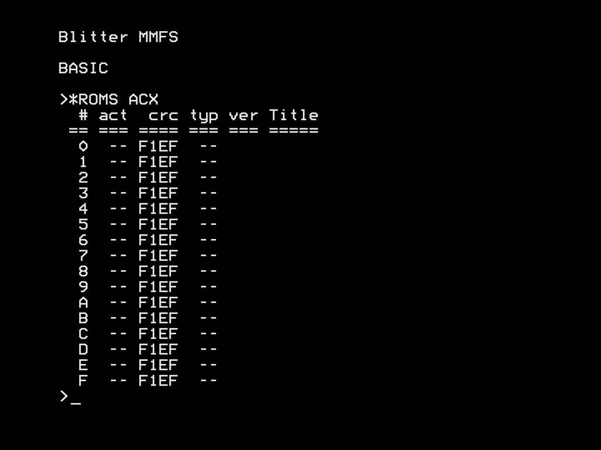

You can now switch back to t65 mode - long BREAK - and use SRLOAD to load the 
following ROMS

    *SRLOAD BLTUTIL FX
    *SRLOAD BAS432 BX
    *SRLOAD BBLMMFS DX

If you were to boot to 65816 - hold button 3, long BREAK - you should now be
in business but note we've loaded a newer version of BASIC 4r32 from the Master
MOS 3.50. As we've booted to the 65816, which supports the relevant 65C102 
instructions, and the BASIC ROMs don't access hardware directly we can run
this newer ROM.

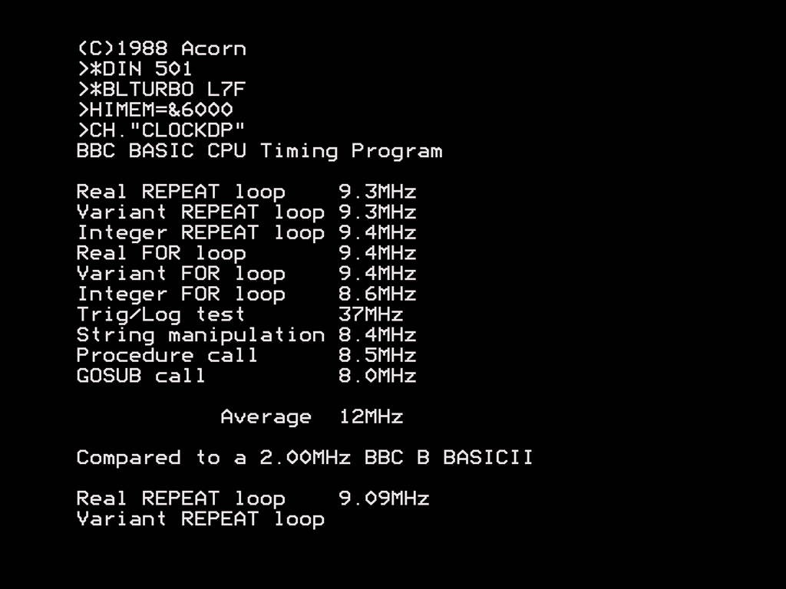

This appears to have made the CPU run about 1MHz faster and about 33MHz faster
for trig! It hasn't really it's just BASIC 4r32 uses some of the advanced 
instructions and a lot of optimisations were done to the trig functions
over the years.

# Preboot Menu System

As there are no physical PROMs in the C20K it is relatively easy to update the
MOS and ROMS and hence also easy to brick the machine. For this reason a pre-
boot menu system is available. 

If you reset or power-cycle the machine with CTRL-DELETE-BREAK held down then
release BREAK you should be presented with the preboot menu system:

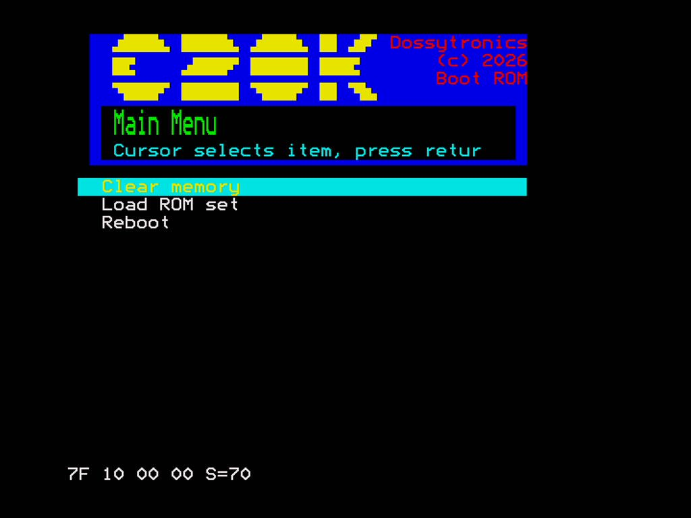

The preboot system is a new feature and is only in beta testing. More features
are being added actively.

You can use the cursor keys to select menu items, RETurn to select and ESCape
to exit/cancel.

# Clear memory

This feature can be used to clear out ROM slots in either map 0 or map 1 and
select whether to clear all memory in the map or just (F)lash or (R)am or 
(B)oth


# Load romset 

This feature allows you to load a pre-baked set of ROMS. 

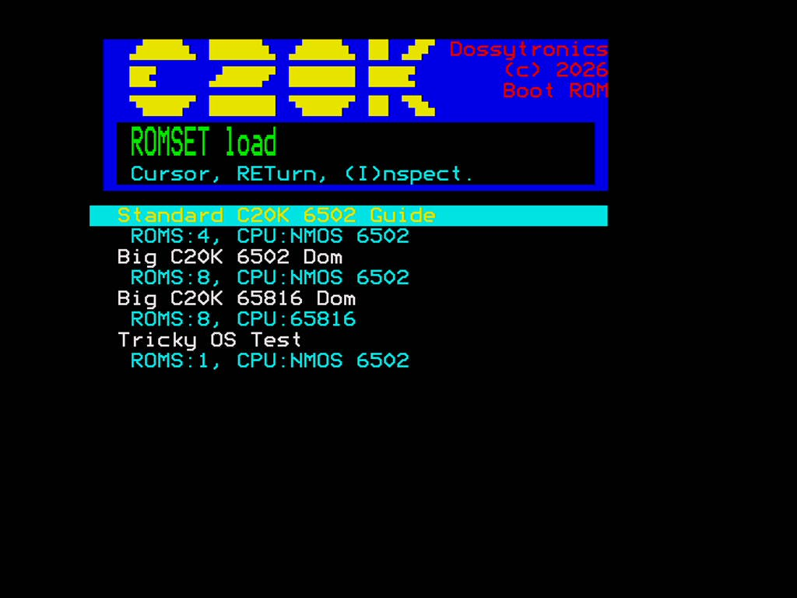

Use the arrow keys to navigate to a set of interest...say the Big 65816 set and
press (I) to investigate which will list the ROMs in the set.

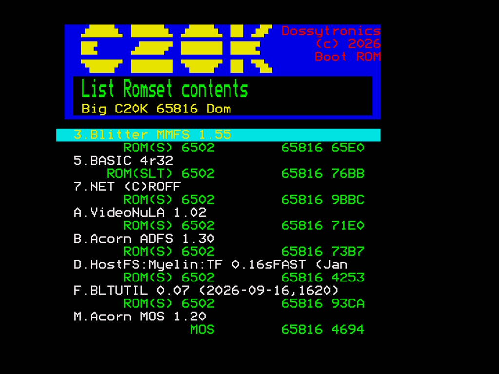

This shows some information about the ROMs and their checksums.

Press ESCape to return to the menu and select the Big 65816 set and press 
RETurn to load this romset then press "1" to load to map "1".

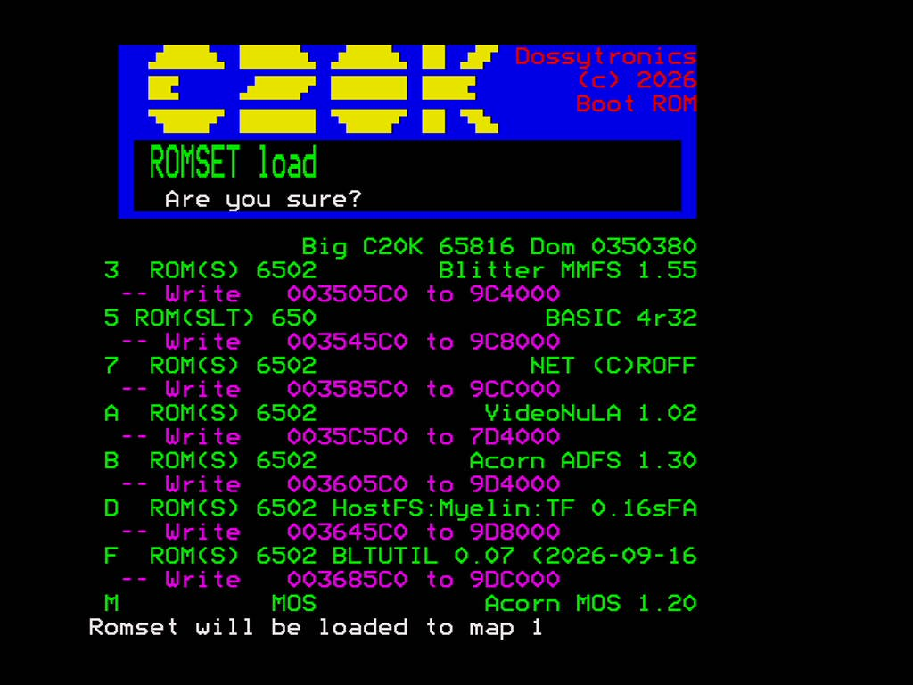

Confirm with "Y" and it will load the ROMs

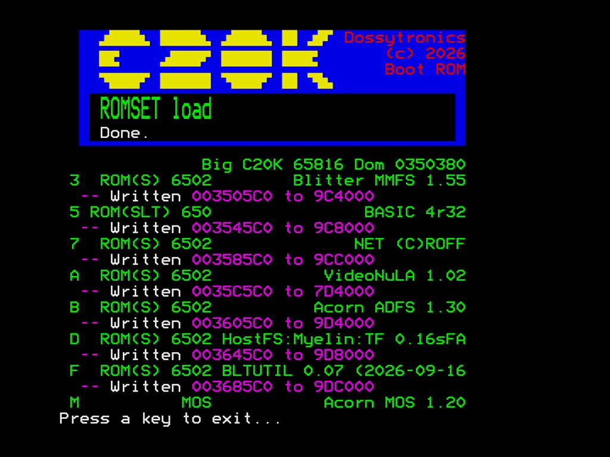

Wait until it says "press a key to exit..." at the bottom. Then press a key to
return to the main menu and use the "Reboot" feature to reboot the machine.

Note: load romset doesn't clear out slots not in the set of ROMs, if you're 
starting from scratch it's usually wise to use the Clear memory function to 
clear the entire map.

# Reboot

This will restart the C20K, it should restart with the same 65816/map options. 
It will always force a cold-boot though to ensure update ROMs are registered.

You can now test the new romset by holding button 3 with a long BREAK
