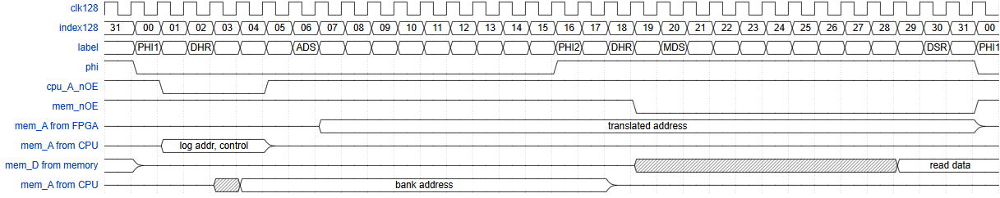

# C20K CPU Pin Sharing and Multiplexing

To save on the number of FPGA pins needed to drive the Memory and CPU on the 
C20K many of the pins are shared between the CPU and memory subsystem and
some pins are time-multiplexed on the CPU.

## Pros
 - reduced pin count

This was the main driver - pins on the FPGA were at a premium. If this were
a BITD implementation with LSI logic or ULAs then a similar shared bus would
probably be needed.

## Cons
 - maximum CPU / memory speed reduced
 - complexity
 - CPU cannot operate in tandem with DMA/Blitter/Sound

The speed issue particularly applies to the CPU as some time will be needed to
time multiplex the pins and to allow for "dead time" whilst the buffers and
bus reverse the maximum CPU speed is limited to ~8MHz - this was the design
goal speed anyway.

Complexity, especially when bus-mastering and switching between the 65816 CPU
and the emulated 6502 and or RiscV is increased but is not unmanageable.

For the CPU and DMA to be able to run at the same time would in any case 
require a crossbar switch or other complex bus switching and increased code 
complexity which probably would not be worth the effort.

# What is shared and multiplexed

## Address lines shared

There are a lot address lines needed for the memory (21) and CPU (16) it makes
sense to share these as they place a large burden on the pin budget and as 
outlined below they can be multiplexed...

## CPU address lines multiplexed

Because address lines are shared between both the CPU (logical address) and the
ROM/RAM memory address. As the address presented by the CPU if often altered
i.e. when accessing sideways RAM via the ROM or JIM/FRED interfaces then the
Address lines are also multiplexed. i.e. the top 16 bits of the 24 bit address
are sampled early in the CPU Phi1 cycle and possibly re-written in the Phi2 
cycle. The bottom 8-bits of the address are no multiplexed.

## CPU address lines and control lines

The 65816 has a number of control lines (MLB, VPB, VPA, VDA, RnW) that are 
can be sampled at the same time as the 16-bit address presented on the address
lines. It should be remembered that the bank address for the 65816 is presented
on the data lines during Phi1. As the memory and cpu address lines are already 
multiplexed these extra signals can be multiplexed on some of the address lines
that are not used during the CPU Phi1 cycle, namely (A16-A20)

## Bus mastering

When a master other then the CPU wants to access the memory then the cpu must
be halted for one or more cycles while the other bus master uses the memory bus.

# Time multiplexing

As much of the internal FPGA logic runs on a 128 MHz clock that has been chosen
as the time-slice interval for multiplexing. If this multiplexing were to be
carried out using LSI or ULA logic then delays might be inserted using a slower
clock with deliberate logic delays.

  |Name				| Slice #	| Notes
  |:----------------|----------:|:-----------------------------------------
  |PHI1				|        0	| Start of phi1 clock phase
  |DHR				|        2	| Data held from previous cycle read
  |ADS				|        6	| Address setup (including control signals)
  |PHI2				|        16	| Start of phi2 clock phase
  |PHI2DHR			|        18	| End of bank address hold from cpu
  |MDS				|        20	| Write data setup cycle
  |PHI2DSR			|        30	| Read data setup cycle
  |TOTAL			|        32	| Length of a whole cycle

# How it works

The CPU Address lines 0..7 and data lines can be taken off the bus using the 
CPU's *BE* signal

The CPU Address lines 8..15 and control lines are buffered on to the bus via
9 but 74xx244 buffered controlled by the CPU_nOE signal

The Memory only drives the databus when MEM_nOE is active.

# Timing diagrams

This is an example timing diagram for a read from local memory, each clock
is approx 7.8ns

